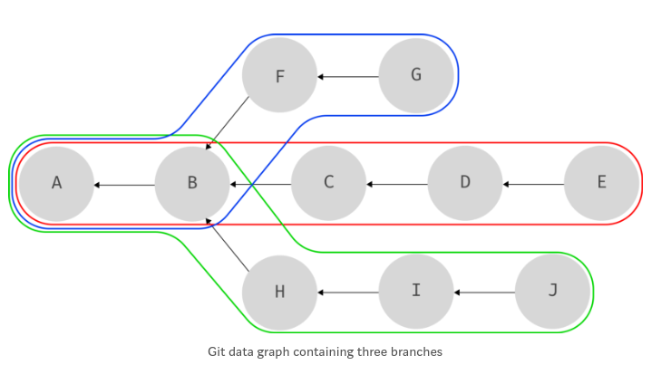

<!-- tag: [git] -->

# Introduction

- Hi guys! Trước khi bắt đầu với git's branch. Mình nghĩ chúng ta nên có một sự hiểu biết nhất định về [git's data model](https://hackernoon.com/https-medium-com-zspajich-understanding-git-data-model-95eb16cc99f5). (nếu bạn muốn có một bài dịch cho đường link đó vui lòng thông tin cho m :D ).

- Còn đây là nhận xét từ git scm về lợi ích việc hiểu git branch: "Understanding and mastering this feature ([git's branch](https://git-scm.com/book/en/v2/Git-Branching-Branches-in-a-Nutshell)) gives you a powerful and unique tool and can entirely change the way that you develop."

# Git's branch

- Cùng hình dung chúng ta có 1 đồ thị lịch sử các commit như dưới:

  

- Khá dễ dàng để nhận ra chúng ta có 3 branch: RED(A,B,C,D,E), BLUE( A,B, F ,G), GREEN(A,B,H,I,J)

  

- Nhìn có vẻ như chúng ta có thể định nghĩa branch: Tập các commit mà branch đó chứa (RED: A,B,C,D,E). Tuy nhiên đó ko phải cách git đang làm. Git sử dụng một giải pháp đơn giản, hiệu quả hơn. Thay vì phải có danh sách tất cả các commit thuộc về một branch, và giữ cho danh sách này được cập nhật, git đơn giản chỉ cần để mắt tới commit cuối cùng trên branch đó. Khi biết commit này việc tạo lại danh sách các commit của branch bằng cách lần theo hướng đồ thị khá đơn giản.
- Cho ví dụ như branch BLUE, chúng ta chỉ cần biết commit G cuối cùng. Và nếu chúng ta cần danh sách commit của branch BLUE chúng ta có thể theo hướng đồ thị bắt đầu từ G để tìm ra:

  

- Đó là cách git quản lý các branch bằng cách giữ con trỏ tới các commit. Cùng làm ví dụ để hiểu rõ hơn.

# In action

- Đầu tiên chúng ta khởi tạo một repository

```sh linenums="1"
  git init
```

- Cùng xem folder `.git`

```sh linenums="1"
  $ tree .git
  .git
  ├── branches
  ├── config
  ├── description
  ├── HEAD
  ├── hooks
  │   ├── applypatch-msg.sample
  │   ├── commit-msg.sample
  │   ├── fsmonitor-watchman.sample
  │   ├── post-update.sample
  │   ├── pre-applypatch.sample
  │   ├── pre-commit.sample
  │   ├── prepare-commit-msg.sample
  │   ├── pre-push.sample
  │   ├── pre-rebase.sample
  │   ├── pre-receive.sample
  │   └── update.sample
  ├── info
  │   └── exclude
  ├── objects
  │   ├── info
  │   └── pack
  └── refs
      ├── heads
      └── tags

  9 directories, 15 files
```

- Cùng để ý tới folder `refs`. Nó viết tắt của `refernces` và đó cũng là nơi git lưu trữ các con trỏ của branch.
- Chúng ta chưa commit gì cả, bởi vậy `refs` chống rỗng, cùng thay đổi nó nào, bằng cách tạo và commit một vài file.

```sh linenums="1"
  $ echo "Hello World" > helloEarth.txt
  $ git add .
  $ git commit -m "Hello World Commit"
  [master (root-commit) 38de966] Hello World Commit
  1 file changed, 1 insertion(+)
  create mode 100644 helloEarth.txt

  $ echo "Hello Mars" > helloMars.txt
  $ git add .
  $ git commit -m "Hello Mars Commit"
  [master 7ad6ee6] Hello Mars Commit
  1 file changed, 1 insertion(+)
  create mode 100644 helloMars.txt

  $ echo "Hello Saturn" > helloSaturn.txt
  $ git add .
  $ git commit -m "Hello Saturn Commit"
  [master 1c13b07] Hello Saturn Commit
  1 file changed, 1 insertion(+)
  create mode 100644 helloSaturn.txt

```

- Cùng kiểm tra xem chúng ta đang ở đâu với `git branch`:

```sh linenums="1"
  $ git branch
  * master
```

- Điều này có nghĩa chúng ta đang ở nhánh master(nguyên nhân do git tạo tự động dựa trên lần commit đầu tiên của chúng ta).
- Giờ hãy cùng kiểm tra lại `.git/refs`:

```sh linenums="1"
  └── refs
    ├── heads
    │   └── master
    └── tags
```

- Để ý `master` trong folder `refs/heads` rất giống branch chúng ta :D. Cùng kiểm tra nội dung của nó nào:

```sh linenums="1"
  $ cat .git/refs/heads/master
  1c13b0776353a951d3b1a5c74f89c0bee810f2b9
```

- Và nếu chúng ta check log:

```sh linenums="1"
  git log
```

- Đây là phần đầu của output:

```sh linenums="1"
  commit 1c13b0776353a951d3b1a5c74f89c0bee810f2b9 (HEAD -> master)
  Author: fenixpapu <phucluongngoc@gmail.com>
  Date:   Sat Jun 22 23:27:15 2019 +0700

      Hello Saturn Commit
```

- YEAH! Bạn thấy đó. Một branch trong git đơn giản chỉ là một file chứa checksum của commit cuối cùng trên branch đó. Hay đơn giản: một con trỏ tới một commit :D.
- Nếu chúng ta tạo và checkout ra một branch mới và kiểm tra thư mục `.git/refs`

```sh linenums="1"
  git checkout -b feature
  Switched to a new branch 'feature'
  $ tree .git/refs/
  .git/refs/
  ├── heads
  │   ├── feature
  │   └── master
  └── tags

  2 directories, 2 files
```

- Giờ chúng ta có thêm `feature`. Và kiểm tra checksum(pointer) nào:

```sh linenums="1"
  $ cat .git/refs/heads/feature
  1c13b0776353a951d3b1a5c74f89c0bee810f2b9
```

- Do chúng ta không có thêm commit nào trên nhánh này nên cả `feature` và `master` đang trỏ tới cùng một commit.
- Đó là cách nhanh gọn và hiệu quả mà git tạo ra một branch: tạo một text file và cập nhật vào nó với checksum của commit hiện tại.

- Một câu hỏi đặt ra, chúng ta đang có 2 branch, làm thế nào git biết chúng ta đang checked trên branch nào? Có một con trỏ đặc biệt hơn một chút `HEAD`. Nó đặc biệt vì nó thường không trỏ tới một object commit, nhưng trỏ tới `ref(branch)` và git dùng nó để theo dõi branch nào hiện tại đang được checkout.

- Nó ở đây nè:

```sh linenums="1"
  $ cat .git/HEAD
  ref: refs/heads/feature
```

- Thử chuyển branch để kiểm tra lại nhé:

```sh linenums="1"
  $ git checkout master
  Switched to branch 'master'
  $ cat .git/HEAD
  ref: refs/heads/master
```

- Như bạn thấy đó giờ HEAD chuyển qua master.
- Chỉ đơn giản vậy thôi, nhưng lại khá quan trọng cho chúng ta để hiểu các hoạt động của git khi thao tác trên đồ thị các branch này (như merge, rebase, checkout, revert...).
