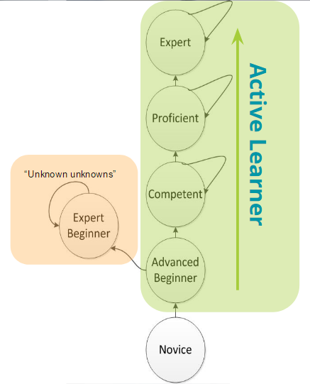

# Active Learner — How developers keep learning

- Đây là một bài dịch. Bản thân thấy có ích nên mình lượm lặt lại. Link bài gốc [tại đây](https://hackernoon.com/active-learner-how-developers-keep-learning-1309b91f1ae6)

* Vài tuần trước tôi đã có buổi nói chuyện tại Hội nghị thường niên Geektime dành cho các bạn Developer chủ đề Active Learner. Sau hội nghị, tôi quyết định viết một article chi tiết về chủ đề này. Bạn có thể tìm [slide](https://speakerdeck.com/dennisnerush/active-learner-how-developers-keep-learning) và [video](https://www.youtube.com/watch?v=3GrNFnKNy-I). Năm 2018, tôi lại có cơ hội trao đổi về chủ đề này tại [Hội nghị thường niên Amsterdam Codemotion dành cho Developer](https://www.youtube.com/watch?v=tKoTO8A-vVY).

## Expert Beginners

- Trở thành Developer là một hành trình dài mà bạn bắt đầu xuất phát ngay sau khi học viết code và bắt tay vào công việc đầu tiên của mình. Hành trình này được chia thành nhiều giai đoạn khác nhau và ai trong số các Developer cũng đều phải trải qua từ junior, senior và lên expert. Tuy nhiên hôm nay tôi muốn đề cập đến một giai đoạn khác – một giai đoạn khó khăn mà không phải ai cũng nhận ra.

- Bạn hẳn đã gặp ở đâu đó những Developer tràn đầy sự tự tin. Họ có thể mô tả về sản phẩm mình đang build, giải thích về architecture, những lợi thế công nghệ và vấn đề mà sản phẩm có thể giải quyết một cách trôi chảy. Những Developer này có thể nói về các tools, framework, infrastructure mà họ đang sử dụng hàng ngày. **Họ tự hào về những sản phẩm của mình**.

- Nhưng thật tiếc những Developer này không thực sự hiểu cách thức mọi thứ vận hành! Họ không hiểu cấu trúc bên trong và cách những tools này được xây dựng, hay cả những nhược điểm và những trường hợp không nên sử dụng những tools nhất định. Họ quả quyết rằng không có gì tốt hơn những tools mình đang biết và tools mà họ lựa chọn là phương án tối ưu cho họ và cho tất cả mọi người. Những Developer này thực chất chỉ là “Chuyên gia tập sự” [(Expert Beginner)](https://daedtech.com/how-developers-stop-learning-rise-of-the-expert-beginner/). Họ nghĩ bản thân mình đã trở thành chuyên gia nhưng hóa ra lại chỉ vừa mới bắt đầu.

- Bên cạnh đó, có một nhóm Developer sở hữu lối tư duy hoàn toàn khác!

- Những Developer này có thể giải quyết bất kỳ vấn đề nào, hiểu rõ cách mọi thứ vận hành, cách xây dựng và lý do lựa chọn một framework nhất định và **tại sao**. Họ nắm bắt các xu hướng mới trong ngành nhưng đồng thời cũng hiểu lý do những công nghệ này được đánh giá cao và tại sao có những công ty **không nên** áp dụng chúng.

- Đó chính xác là những Developer mà chúng tôi muốn tuyển dụng! Những Developer như vậy không thuộc tuýp Expert Beginner và họ cũng không phải một chuyên gia theo cách nào đó. Quan trọng hơn cả, họ có khả năng nhận thức được những gì mình đang biết và chưa biết. Họ đang trên con đường trở thành những chuyên gia thực thụ và để đi theo con đường này, họ không chỉ dựa vào lượng kiến thức có được từ công việc hiện tại, những sáng kiến “out of the box” nhưng thực ra vẫn quẩn quanh các vấn đề phát sinh thường nhật. Họ phải chủ động học hỏi nhiều hơn thế!

- They are **“Active learners”**(người tích cực học).

## Tại sao điều này xảy ra

- Để hiểu điều này trước tiên chúng ta cần hiểu cách một người học một kỹ năng mới :

  

- Đây là một mô hình đơn giản của quá trình tiếp thu kỹ năng mới. Về cơ bản mô hình chỉ ra rằng để trở thành chuyên gia, chúng ta phải trải qua một chặng đường dài với các giai đoạn khác nhau. Tại mỗi giai đoạn chúng ta sẽ hoàn thiện dần những kỹ năng mình đang có, từ đó làm mọi thứ tốt hơn. Chúng ta cố gắng thực hiện điều đó bằng cách ngầm hiểu rằng có một bức tranh lớn hơn những gì mình đang biết và điều cần làm là tìm tòi, khám phá không ngừng nghỉ để nắm bắt rõ hơn từng khía cạnh của bức tranh này và dần hoàn thiện mọi thứ.

- Tôi muốn tập trung vào giai đoạn Advanced Beginner bởi tại mốc này, bất kỳ ai cũng phải lựa chọn 1 trong 2 ngã rẽ: (1) chuyển sang giai đoạn “Competent”, nghĩa là tiếp tục thu nạp thêm các kỹ năng cần thiết, tìm hiểu những khía cạnh mới của một bức tranh lớn hơn và xác định vị trí của mình trong đó; (2) **“tự xét tốt nghiệp”**, chuyển sang giai đoạn Expert Beginner và tự mặc định mình đã được tốt nghiệp ở cấp độ Chuyên gia. Expert Beginner là một giai đoạn vô cùng nguy hiểm khi Developer lầm tưởng mình đã trở thành một chuyên gia, giảm dần các cố gắng để cải thiện bản thân hay không nhận ra rằng có một bức tranh lớn hơn những gì họ đang biết.

## Làm cách nào những develop rẽ theo lối này trong khi số khác thì không?

### Thay đổi công nghệ liên tục

- Thế giới của chúng ta liên tục dịch chuyển, các công nghệ, framework và các tools mới cũng xuất hiện hàng năm. Truy tìm các công nghệ mới nổi và ứng dụng chúng ngay lập tức được xem là một phản ứng “thời thượng” và rất “cool ngầu”

- Vậy nhưng, điều đó làm cho việc trở thành một chuyên gia đúng nghĩa trở nên khó khăn hơn cả bởi mọi thứ thay đổi liên tục. Chạy theo các công nghệ mới nổi khiến Developer phải liên tục chuyển đổi công nghệ mà chưa kịp nghiên cứu sâu và master công nghệ đó.

### Fullstack != Expert

- Lý do thứ hai là **quan điểm sai lầm** của một số Developer khi đồng nghĩa Fullstack với Expert. Tất nhiên thực tế vẫn có những Fullstack Developer thực sự là chuyên gia. Tôi sẽ không đề cập đến họ trong trường hợp này.

- Tôi muốn bàn tới những Developer hoàn thành React và Node tutorial, dựng 1 app to-do, deploy nó bằng 1 cú click chuột trên Heroku và tự xem mình là 1 **Fullstack Developer**. Họ nhìn thấy kết quả ngay lập tức mà không thực sự hiểu về “điều kỳ diệu” đã xảy ra, hệ thống sẽ scale thế nào? Nhược điểm của platform hiện tại? Khi nào họ nên hay không nên sử dụng platform đó?

- Thêm một lý do khác là các Developer bị mắc kẹt trong một hệ sinh thái duy nhất suốt một thời gian dài – một con đường mòn mà ở đó bạn luôn cảm thấy thoải mái khi làm việc trong một team suốt nhiều năm, phát triển các tính năng giống nhau, fix các lỗi tương tự, lặp đi lặp lại và về cơ bản không học được điều gì mới. Một dạng khác của con đường mòn này là khi bạn thay đổi nơi làm việc, chuyển sang các công ty khác nhau, nhưng thực tế vẫn ở trong cùng một hệ sinh thái, làm việc cùng một vị trí, cùng trách nhiệm và sử dụng cùng tools. Một lần nữa, bạn không học được gì mới mẻ.

```text linenums="1"
10 năm kinh nghiệm hay 10 lần kinh nghiệm của một năm
```

- Có những người nhìn qua tưởng chừng có nhiều năm kinh nghiệm nhưng thực ra chỉ là lặp đi lặp lại một set kinh nghiệm cũ qua nhiều năm. Tôi đã từng đọc CV của rất nhiều Developer có 6 hay thậm chí 9 năm làm việc trong ngành, nhưng khi nói chuyện, nhưng khi nói chuyện những kinh nghiệm đó lại rất mờ nhạt giống như đang nói chuyện với một Junior Developer hơn là một Senior Developer

## Passive Learning

- Điều cuối cùng là trong thực tế những Expert Beginner chỉ học những gì họ tiếp xúc hàng ngày, những công nghệ và thách thức phát sinh trực tiếp trong công việc buộc họ phải học để giải quyết. Cách học này thực sự giới hạn bởi có rất nhiều giải pháp thay thế ngoài kia mà những Expert Beginner này chưa nhận thức được.

- Khi nói chuyện với Expert Beginner, đặt cho họ những câu hỏi có chiều sâu, bạn sẽ thường nhận được những câu trả lời như:

```text linenums="1"
"This is a `black box`"
"It `magiccally` works"
"That was here `before me`"
"The `other team` is responsible for this"
"X sucks, Y is the best, `It just is`"
```

- Những câu trả lời bạn nhận được không có chiều sâu được thể hiện bằng qua sự am hiểu về nguyên lý hoạt động và đáp án cho câu hỏi “Tại sao”

- Tựu chung lại sự khác biệt quan trọng nhất giữa Expert Beginner và Active Learner là Active Learner không cần biết hết tất cả mọi thứ. Họ nhận thức được sự tồn tại của một bức tranh lớn hơn tầm hiểu biết của họ, không có gì vận hành đơn thuần, không có phương án tối ưu cho mọi tình huống, mọi thứ đều có ưu và nhược điểm. Họ không vội kết luận mà muốn tìm hiểu kỹ càng và hiểu vấn đề một cách sâu sắc.

## How can one become an “Active Learner”?

- Học chủ động- Active learning không phải là một giai đoạn mà là một dạng **mindset**, một trạng thái của tư duy khi bất kỳ ai nhận tự nhận thức được giới hạn kiến thức của bản thân và kỳ vọng tìm hiểu nhiều hơn những gì mình đang có đều có thể trở thành một Active Learner

  

- Dưới đây là 4 công cụ cơ bản có thể giúp bất kỳ Active Learner nào đạt được mục tiêu của mình:

### Read

- Đọc sách là cách đầu tiên và dễ nhất bạn có thể sử dụng để học chủ động. Hàng nghìn đầu sách, blog, videos, podcasts về bất kỳ chủ đề nào đều có sẵn trên Internet. Chúng ở đó chỉ để chờ được bạn tìm kiếm.

- Hãy đọc về những gì bạn đang biết, củng cố kiến thức hiện tại, đào sâu hơn và thực sự hiểu về cách thức hoạt động của chúng. Bạn cũng cần đọc về những gì mình chưa biết, ngừng tin vào “magic” hay black box, thay vào đó hãy google để hiểu cách thức hoạt động của chúng, đừng lấy bất cứ thứ gì bạn được trao cho.

### Leave your comfort zone

- Để thực sự học được nhiều điều mới, chúng ta cần trải nghiệm những điều mình chưa biết và làm việc tại những nơi còn nhiều thiếu sót, chúng ta cần rời khỏi vùng an toàn hiện tại, thay đổi môi trường và đôi khi thậm chí bắt đầu lại ở một nơi hoàn toàn khác. Bởi thật quá dễ dàng nếu tiếp tục làm đi làm lại những gì chúng ta đã biết.

- Phát triển phần mềm không phải là framework hay ngôn ngữ mà bạn biết, phát triển phần mềm là các nguyên tắc, SOLID, DRY, KISS, tự động hóa… Các nguyên tắc này là đa nền tảng. Hãy thử những thứ bạn không quen thuộc, những tools và framework khác nhau. Đừng chỉ vì chúng đang **hot**, nhưng hiểu cách chúng giải quyết những vấn đề bạn đang phải đối mặt. Hãy bước ra khỏi nơi mà mọi thứ đã được chuẩn bị sẵn sàng và mọi thứ chỉ đơn giản là "hoạt động" ( tức bạn không hiểu nó hoạt động như thế nào ?).

```text linenums="1"
Hãy thử tự tạo ra magic box và black box
```

- Bạn sẽ nhận ra rằng các ngôn ngữ, framework, tools đều có chung những principles nhất định. Tìm tòi, khám phá nhiều lần một vấn đề sẽ củng cố khả năng hiểu biết và bạn có thể ứng dụng chúng ở bất kỳ đâu.

### Share Your Knowledge — Write

- Viết không phải là một điều dễ dàng. Bạn không thể chia sẻ một nửa sự thật hay trình bày một vấn đề nếu chưa hiểu rõ ràng về nó. Viết về bất kỳ chủ đề nào cũng sẽ khiến bạn hiểu sâu sắc hơn. Bạn có thể kể một câu chuyện, mở đầu một cuộc thảo luận và giải thích tại sao công nghệ đó lại tuyệt vời với mọi người. Khả năng viết lách không chỉ hữu ích khi bạn đặt bút viết mà còn tỏ ra hữu hiệu nếu bạn cần chia sẻ quan điểm của bản thân. Viết càng nhiều, khả năng viết lách của bạn càng được mài dũa. Đây là một trong những lý do khiến tôi lập blog để viết về các chủ đề khác nhau và tôi buộc tôi phải tìm hiểu cho đế khi thực sự hiểu chúng trước khi chia sẻ lại với thế giới.

### After School Activities

- Học thụ động trong công việc là một bức tường trong suốt, ít ai nhận ra. Có nhiều cách khác để nâng cao kinh nghiệm của mình. Những Active Learner sử dụng thời gian sau giờ làm việc để học những thứ mà công việc của họ không thể cung cấp. Hãy meet up, đi gặp gỡ những người sử dụng cùng loại tool hay những người đang giải quyết vấn đề tương tự như bạn để xem cách họ đang xử lý mọi thứ và học hỏi từ họ. Hãy thử đóng góp cho open source, xem qua một số dự án trên open source mà bạn yêu thích, giúp đỡ họ, giải quyết vấn đề hoặc thêm một tính năng. Đóng góp cho open source sẽ nâng các kỹ năng của bạn cao hơn bạn nghĩ.

- Và thực sự, chỉ cần mở máy tính và code, code bất cứ điều gì bạn muốn và bất cứ điều gì bạn đam mê. Mỗi khi bạn develop một thứ gì đó mà bạn đã từng xem là điều kỳ diệu hay black box, bạn đã củng cố kỹ năng và hiểu biết của mình. Đừng quên tìm hiểu khi nào nên sử dụng những tools đó, khi nào thì không nhé!

```text linenums="1"
"I hear and I forget.
I see and I remember.
I DO AND I UNDERSTAND"
        - Nho giáo -
```

### One more thing

- Hãy lặp đi lặp lại các bước trên. Nó là một chặng đường dài, nhưng nó đang giá.

### Happy active learning!
