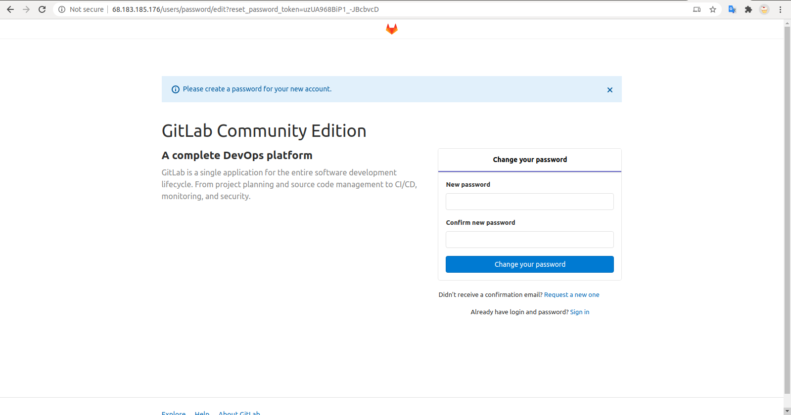

# DRAFT Install gitlab and running gitlab ci

- Dự án mình làm cần dùng gitlab-ci vào vài việc nhỏ nên cài thử gitlab vọc luôn xem sao.

- Bài này là QUÁ TRÌNH cài đặt gitlab trên cloud và chạy ci.(từ một server trắng chưa cài đặt gì). Thôi CI sẽ udpate trong bài sau.

## Prepare

- Thông tin host. Mình cài trên vm của digital ocean, centos 8

```terminal linenums="1"
[root@centos-s-6vcpu-16gb-sgp1-01 ~]# hostnamectl
  Static hostname: centos-s-6vcpu-16gb-sgp1-01
        Icon name: computer-vm
          Chassis: vm
        Machine ID: trashID
          Boot ID: trashID
    Virtualization: kvm
  Operating System: CentOS Linux 8 (Core)
      CPE OS Name: cpe:/o:centos:centos:8
            Kernel: Linux 4.18.0-193.6.3.el8_2.x86_64
      Architecture: x86-64
```

- Trước tiên cần [cài đặt docker](https://docs.docker.com/engine/install/centos/). Chúng ta có 3 cách:

  - Cài đặt từ repo của docker. Khuyến khích dùng cách này.
  - Download gói RPM, cài đặt và upgrade thủ công. Phù hợp với hệ thống bảo mật cao, không được phép kết nối với internet :D
  - Đôi khi một số người chọn cách dùng script tự động gen.

- Trong phần này mình chọn cách một.

- Set up Repository

```terminal linenums="1"
  sudo yum install -y yum-utils
  sudo yum-config-manager \
    --add-repo \
    https://download.docker.com/linux/centos/docker-ce.repo
```

- Bỏ qua hết đoạn optional
- Install docker engine

```terminal linenums="1"
  sudo yum install docker-ce docker-ce-cli containerd.io
```

- Nếu gặp lỗi như này:

```terminal linenums="1"
[root@centos-s-6vcpu-16gb-sgp1-01 ~]# sudo yum install docker-ce docker-ce-cli containerd.io
Docker CE Stable - x86_64                                                                                                    18 kB/s |  25 kB     00:01
Error:
Problem: package docker-ce-3:19.03.12-3.el7.x86_64 requires containerd.io >= 1.2.2-3, but none of the providers can be installed
  - cannot install the best candidate for the job
  - package containerd.io-1.2.10-3.2.el7.x86_64 is filtered out by modular filtering
  - package containerd.io-1.2.13-3.1.el7.x86_64 is filtered out by modular filtering
  - package containerd.io-1.2.13-3.2.el7.x86_64 is filtered out by modular filtering
  - package containerd.io-1.2.2-3.3.el7.x86_64 is filtered out by modular filtering
  - package containerd.io-1.2.2-3.el7.x86_64 is filtered out by modular filtering
  - package containerd.io-1.2.4-3.1.el7.x86_64 is filtered out by modular filtering
  - package containerd.io-1.2.5-3.1.el7.x86_64 is filtered out by modular filtering
  - package containerd.io-1.2.6-3.3.el7.x86_64 is filtered out by modular filtering
(try to add '--skip-broken' to skip uninstallable packages or '--nobest' to use not only best candidate packages)
```

- Thử chạy lại với tùy chọn như gợi ý trong terminal:

```terminal linenums="1"
  sudo yum install docker-ce docker-ce-cli containerd.io --skip-broken
```

- List all docker version:

```terminal linenums="1"
    yum list docker-ce --showduplicates | sort -r
```

- Chọn một bản để cài:

```sh linenums="1"
  sudo yum install docker-ce-18.09.1 docker-ce-cli-18.09.1 containerd.io
```

- Start docker và check dịch vụ:

```sh linenums="1"
[root@centos-s-6vcpu-16gb-sgp1-01 ~]# sudo systemctl start docker
[root@centos-s-6vcpu-16gb-sgp1-01 ~]# sudo systemctl status docker
● docker.service - Docker Application Container Engine
  Loaded: loaded (/usr/lib/systemd/system/docker.service; disabled; vendor preset: disabled)
  Active: active (running) since Wed 2020-07-08 09:13:27 UTC; 6s ago
    Docs: https://docs.docker.com
Main PID: 44898 (dockerd)
  Tasks: 31
  Memory: 54.6M
  CGroup: /system.slice/docker.service
          ├─44898 /usr/bin/dockerd -H fd://
          └─44919 containerd --config /var/run/docker/containerd/containerd.toml --log-level info

Thg 7 08 09:13:27 centos-s-6vcpu-16gb-sgp1-01 dockerd[44898]: time="2020-07-08T09:13:27.100426243Z" level=info msg="Graph migration to content-addressabili>
Thg 7 08 09:13:27 centos-s-6vcpu-16gb-sgp1-01 dockerd[44898]: time="2020-07-08T09:13:27.101106507Z" level=warning msg="Your kernel does not support cgroup >
Thg 7 08 09:13:27 centos-s-6vcpu-16gb-sgp1-01 dockerd[44898]: time="2020-07-08T09:13:27.101137868Z" level=warning msg="Your kernel does not support cgroup >
Thg 7 08 09:13:27 centos-s-6vcpu-16gb-sgp1-01 dockerd[44898]: time="2020-07-08T09:13:27.101822705Z" level=info msg="Loading containers: start."
Thg 7 08 09:13:27 centos-s-6vcpu-16gb-sgp1-01 dockerd[44898]: time="2020-07-08T09:13:27.407012924Z" level=info msg="Default bridge (docker0) is assigned wi>
Thg 7 08 09:13:27 centos-s-6vcpu-16gb-sgp1-01 dockerd[44898]: time="2020-07-08T09:13:27.503096827Z" level=info msg="Loading containers: done."
Thg 7 08 09:13:27 centos-s-6vcpu-16gb-sgp1-01 dockerd[44898]: time="2020-07-08T09:13:27.545559773Z" level=info msg="Docker daemon" commit=4c52b90 graphdriv>
Thg 7 08 09:13:27 centos-s-6vcpu-16gb-sgp1-01 dockerd[44898]: time="2020-07-08T09:13:27.546294854Z" level=info msg="Daemon has completed initialization"
Thg 7 08 09:13:27 centos-s-6vcpu-16gb-sgp1-01 dockerd[44898]: time="2020-07-08T09:13:27.565992998Z" level=info msg="API listen on /var/run/docker.sock"
Thg 7 08 09:13:27 centos-s-6vcpu-16gb-sgp1-01 systemd[1]: Started Docker Application Container Engine.
lines 1-21/21 (END)

```

## Install on docker

- Cài đặt [gitlab với docker](https://docs.gitlab.com/omnibus/docker/)

- Chuẩn bị volume cho gitlab

```sh linenums="1"
export GITLAB_HOME=/srv/gitlab
```

- Đây là cấu hình hướng dẫn:

```sh linenums="1"
  sudo docker run --detach \
  --hostname gitlab.example.com \
  --publish 443:443 --publish 80:80 --publish 22:22 \
  --name gitlab \
  --restart always \
  --volume $GITLAB_HOME/config:/etc/gitlab:Z \
  --volume $GITLAB_HOME/logs:/var/log/gitlab:Z \
  --volume $GITLAB_HOME/data:/var/opt/gitlab:Z \
  gitlab/gitlab-ce:latest
```

- Có một số vấn đề với cấu hình này:

  - Không bao giờ cài đặt với version `latest`. Latest không phải là version. Chúng ta cần trỏ rõ version ở đây.

  - Cần đổi lại domain do mình chưa có domain mà chỉ có public IP, bỏ port 443 do IP mình chưa có SSL, bỏ port 22 do đang binding để ssh vào con máy ảo rồi. (nếu để cả port 22 khi run image, container của bạn sẽ ở mãi trạng thái `Created` không sang up được - Không tin thử biết ngay.)

- Cấu hình mới trông sẽ như thế này:

```sh linenums="1"
  docker run --detach \
  --hostname <68.183.185.176> \
  --publish 80:80 \
  --name gitlabCE \
  --restart always \
  --volume $GITLAB_HOME/gitlab/config:/etc/gitlab \
  --volume $GITLAB_HOME/gitlab/logs:/var/log/gitlab \
  --volume \$GITLAB_HOME/gitlab/data:/var/opt/gitlab \
  gitlab/gitlab-ce:13.0.5-ce.0
```

- Bị lỗi như dưới thôi hard code vậy:

```sh linenums="1"
  docker: Error response from daemon: create $GITLAB_HOME/config: "$GITLAB_HOME/config" includes invalid characters for a local volume name, only "[a-zA-Z0-9][a-zA-Z0-9_.-]" are allowed. If you intended to pass a host directory, use absolute path.
```

- Chạy lại docker như dưới:

```sh linenums="1"
  docker run --detach \
  --hostname <68.183.185.176> \
  --publish 80:80 \
  --name gitlabCE \
  --restart always \
  --volume /srv/gitlab/config:/etc/gitlab \
  --volume /srv/gitlab/logs:/var/log/gitlab \
  --volume /srv/gitlab/data:/var/opt/gitlab \
  gitlab/gitlab-ce:13.0.5-ce.0
```

- Nhớ đổi `68.183.185.176` với IP hoặc domain của bạn.
- Check lại tình trạng container:

```sh
  [root@centos-s-6vcpu-16gb-sgp1-01 ~]# docker container ls -a
  CONTAINER ID        IMAGE                          COMMAND             CREATED             STATUS                            PORTS                                 NAMES
  15dcb6f3514f        gitlab/gitlab-ce:13.0.5-ce.0   "/assets/wrapper"   3 minutes ago       Up 3 minutes (health: starting)   22/tcp, 443/tcp, 0.0.0.0:80->80/tcp   gitlabCE
```

- Ngay khi container up bạn cần chờ 1 lúc rồi đăng nhập lại là ok.
  
- Thế giới này giờ là của b\* mày :3
  

## [Install gitlab runner](https://docs.gitlab.com/runner/install/docker.html)

- Mềnh thích docker nên sẽ install nó trên 1 container luôn :D. Document cài gitlab-runner cho docker thì [ở đây](https://docs.gitlab.com/runner/install/docker.html).

### Install and start container

- Có 2 options mà mình chọn luôn option 1. Cấu hình mẫu như này:

```sh linenums="1"
docker run -d --name gitlab-runner --restart always \
-v /srv/gitlab-runner/config:/etc/gitlab-runner \
-v /var/run/docker.sock:/var/run/docker.sock \
gitlab/gitlab-runner:latest
```

- Vẫn là vấn đề cũ ko dùng `latest` nên mình đổi lại chút thành:

```sh linenums="1"
docker run -d --name gitlab-runner --restart always \
-v /srv/gitlab-runner/config:/etc/gitlab-runner \
-v /var/run/docker.sock:/var/run/docker.sock \
gitlab/gitlab-runner:v13.1.1
```

### [Registering Runners](https://docs.gitlab.com/runner/register/index.html#docker)

- Sau khi có runner rồi chúng ta cần bind gitlab-runner vào gitlab instance ( chính là con gitlab vừa cài ở trên)

- Trên server gitlab ( phân biệt với gitlab-runner nhé) chọn theo hướng dẫn sau để thấy thông số setup runner:
  **Settings ~> CI/CD ~> Runners** Click `Expand` bạn sẽ thấy thông số như: `http://68.183.185.176/` (link đăng ký runner), token `2R3yu-Zy9-dKuhspHQ1f`.
