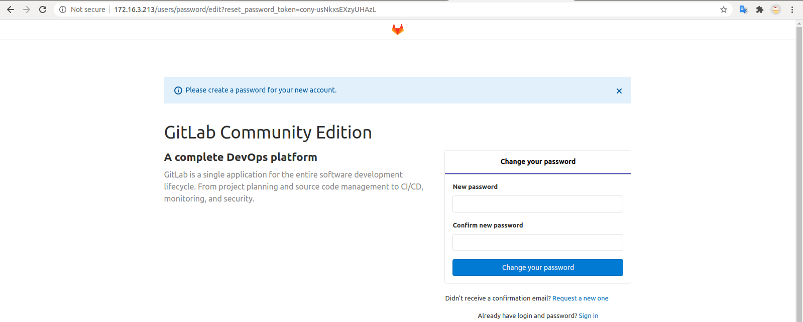

# Cài đặt gitlab trên local

## Trước khi bắt đầu

### Bài toán

- Cài đặt gitlab.

### Giải pháp

- Cài trên docker

### Thảo luận

- Có thể cài trực tiếp trên host, nhưng cài qua docker khi nâng cấp hay xóa sẽ nhanh gọn hơn(cùng với những điểm mạnh khác khi sử dụng docker).

### Yêu cầu

- Ubuntu (Mac, win cũng được, tài liệu này chạy trên ubuntu 20.04 LTS).
- Docker version
- Có kiến thức cơ bản về docker.
- Port dùng cho gitlab 80 nếu có không bị chiếm bởi ứng dụng khác.

## Install

### Xác định private IP trên máy

- Chạy lệnh `ifconfig`:

```sh linenums="1"
$ ifconfig
enp37s0: flags=4163<UP,BROADCAST,RUNNING,MULTICAST>  mtu 1500
        inet 172.16.3.213  netmask 255.255.0.0  broadcast 172.16.255.255
```

- Như output trên thì private IP của máy: `172.16.3.213`. Nếu máy có public IP hoặc domain thì có thể sử dụng (gitlab sau khi cài đặt có thể truy cập từ internet).

### Cài đặt

- Xem hướng dẫn cài gitlab trên trang chủ cho [docker](https://docs.gitlab.com/omnibus/docker/).

- Nhận xét:

  - Không cài chạy docker image với version `latest`. Latest không phải là version.

  - Bỏ port 443 ( chưa có SSL), bỏ port 22 nếu host đang chạy dịch vụ ssh nếu ko bỏ port 22 container khi chạy sẽ ở trạng thái `Created` không chuyển sang `up` được.

- Có thể thay đổi `13.0.5-ce.0` bằng version mới nhất. Với private IP: `172.16.3.213` như trên, chạy lệnh dưới để cài gitlab local:

```sh linenums="1"
    sudo docker run --detach \
    --hostname 172.16.3.213 \
    --publish 80:80 \
    --name gitlabCE \
    --restart always \
    --volume /srv/gitlab/config:/etc/gitlab \
    --volume /srv/gitlab/logs:/var/log/gitlab \
    --volume /srv/gitlab/data:/var/opt/gitlab \
    gitlab/gitlab-ce:13.0.5-ce.0
```

- Nếu chưa có image thì cần chờ 1 lúc để tải image về và thêm thời gian cho container up.
- Sau đó truy cập private IP như dưới là đã có gitlab để xài :3. Nhập mật khẩu(nhớ mật khẩu dùng sau này) cho tài khoản `root`.


