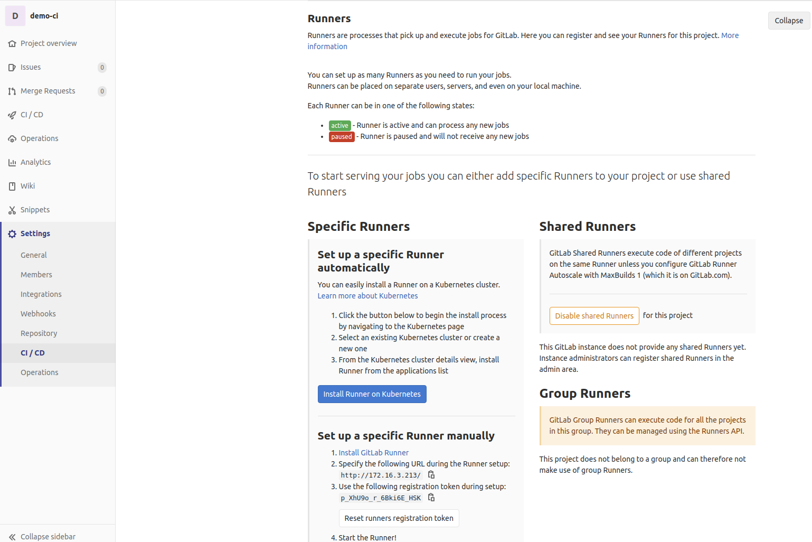

# Install GitLab Runner

## Trước khi bắt đầu

### Bài toán

- Cài đặt Gitlab-Runner để chạy CI/CD cho gitlab.

### Giải pháp

- Cài đặt Gitlab-Runner trên docker.

### Thảo luận

- Gitlab-Runner có thể được cài đặt và sử dụng trên [nhiều nền tảng](https://docs.gitlab.com/runner/install/).

- Sử dụng trên docker là 1 trong các cách nhanh gọn, tiện dụng nhất.

## Install

- Có 2 tùy chọn để chạy Runner ở đây mình chạy luôn option 1 như hướng dẫn ở [đây](https://docs.gitlab.com/runner/install/docker.html#option-1-use-local-system-volume-mounts-to-start-the-runner-container)

- Sửa `latest` của hướng dẫn này thành `v13.1.1` (version mới nhất hiện tại của gitlab-runner). Chạy lệnh:

```sh linenums="1"
sudo docker run -d --name gitlab-runner --restart always \
-v /srv/gitlab-runner/config:/etc/gitlab-runner \
-v /var/run/docker.sock:/var/run/docker.sock \
gitlab/gitlab-runner:v13.1.1
```

## Setup

- Tạo một repo mới với tên `demo-ci`.
- Trong `demo-ci` truy cập: **Settings ~> CI/CD ~> Runner** click `Expand`. Lưu ý phần `link` và `token` trong `Set up a specific Runner automatically`.
  

- Sau khi có gitlab-Runner và repo. Bước tiếp theo đăng ký runner cho repo cụ thể. Hướng dẫn trang chủ ở [đây](https://docs.gitlab.com/runner/register/index.html#docker):

  - Chạy câu lệnh đăng ký:

```sh linenums="1"
docker run --rm -it -v /srv/gitlab-runner/config:/etc/gitlab-runner gitlab/gitlab-runner:v13.1.1 register
```

- Nhập địa chỉ URL của gitlab

  - Như phần lưu ý đã nói trên URL là: `http://172.16.3.213/`

- Nhập token

  - Như phần lưu ý đã nói trên token là: `p_XhU9o_r_6Bki6E_HSK`

- Nhập mô tả cho runner

  - Ví dụ: `one of my runners`

- Nhập tag cho runner vừa cài đặt.

  - Ví dụ: `first-runner`.

- Điền [Runner Executor](https://docs.gitlab.com/runner/executors/README.html)

  - Ví dụ: `docker`

- Điền image name

  - Nếu executor là `docker` thì mới cần điền thêm `image`.
  - Ví dụ nhập: `ubuntu`.

- Khi hoàn tất:

```sh linenums="1"
  $ sudo docker run --rm -it -v /srv/gitlab-runner/config:/etc/gitlab-runner gitlab/gitlab-runner:v13.1.1 register
  Runtime platform                                    arch=amd64 os=linux pid=6 revision=6fbc7474 version=13.1.1
  Running in system-mode.

  Please enter the gitlab-ci coordinator URL (e.g. https://gitlab.com/):
  http://172.16.3.213/
  Please enter the gitlab-ci token for this runner:
  p_XhU9o_r_6Bki6E_HSK
  Please enter the gitlab-ci description for this runner:
  [0647bb754faa]: one of my runners
  Please enter the gitlab-ci tags for this runner (comma separated):
  first-runner
  Registering runner... succeeded                     runner=rWZxJE5j
  Please enter the executor: ssh, docker+machine, docker, docker-ssh, shell, virtualbox, docker-ssh+machine, kubernetes, custom, parallels:
  docker
  Please enter the default Docker image (e.g. ruby:2.6):
  ubuntu
  Runner registered successfully. Feel free to start it, but if it's running already the config should be automatically reloaded!
```

- Nếu quay lại **Settings ~> CI/CD ~> Runners** Click `expand` sẽ thấy Runner được gán vào ntn:

  

- Click biểu tượng `edit` của Runner và tích chọn vào `Run untagged jobs` để chạy cả các jobs untagged. Click `save changes`.
