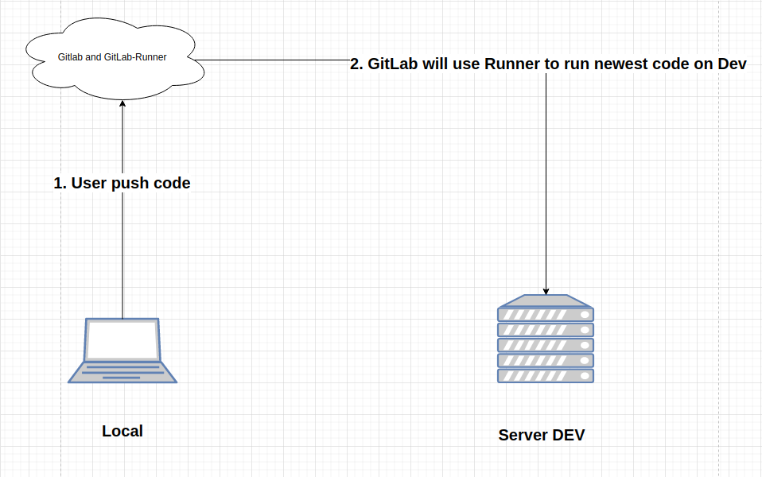
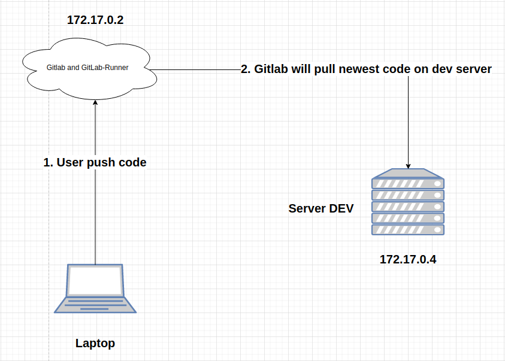
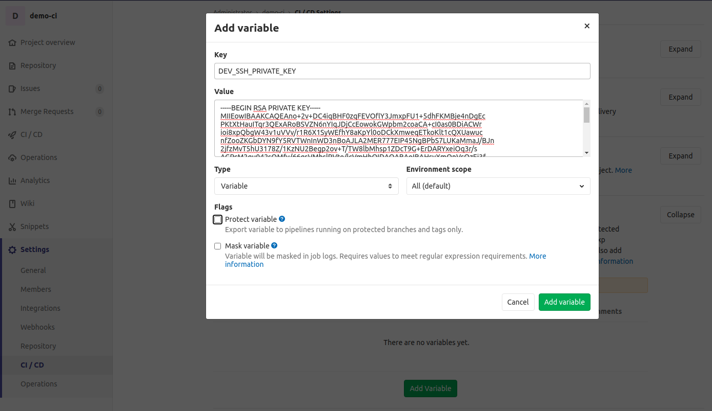

---
authors:
  - PaPu
categories:
  - devops
date: 2020-07-17
draft: false
---

# Run gitlab CI with Runner

## Trước khi bắt đầu

### Bài toán

- Chúng ta có một project `nodejs` lưu trên gitlab và một server `dev-server` chạy code nhánh `dev`
- Yêu cầu mỗi khi code đẩy lên nhánh `dev` trên gitlab. Gitlab tự động kéo code mới nhất trên `dev-server`.
- Code master không làm `dev-server` kéo code mới nhất.
- Mô hình trông sẽ như này:

- 

### Giải pháp

- Sử dụng Runner của gitlab để chạy CI.
- Với Gitlab và Runner đã được cài trước đó.

### Thảo luận

- Có thể sử dụng Jenkins nhưng bài này tập trung thực hành Gitlab Runner.

### Yêu cầu

- Kiến thức cơ bản về docker.

- Kiến thức cơ bản về git.

- Các bước trên thực hiện trên ubuntu 20.04 LTS( trên MACOS ko chắc chắn hoạt động).
<!-- more -->

## Chuẩn bị môi trường

- Chúng ta có gitlab chạy trên IP và một Runner đã được bind vào gitlab.
- Tiếp theo cần một `dev-server` có code `nodejs`. Để phục vụ việc này mình có tạo sẵn một repo. File Dockerfile open ssh(với user/pass: root/root), install git, node.
- Trên máy của bạn clone repo từ github về:

```sh linenums="1"
  $ git clone https://github.com/fenixpapu/demo-ci.git
```

- Di chuyển vào bên trong thư mục `demo-ci` vừa clone về, và build image:

```sh linenums="1"
  $ cd demo-ci/
  $ git checkout dev
  $ docker build -t node-web-app .
```

- Chạy image:

```sh linenums="1"
  $ sudo docker run -p 3000:8080 --name nodejsApp -d node-web-app
```

- Kiểm tra lại IP của Gitlab và `dev-server` vừa chạy xong:

```sh linenums="1"
  $ docker inspect -f '{{ .NetworkSettings.IPAddress }}' gitlabCE
  172.17.0.2
  $ docker inspect -f '{{ .NetworkSettings.IPAddress }}' nodejsApp
  172.17.0.4
```

- Sau khi hoàn tất chúng ta sẽ có mô hình mạng trông như thế này( private IP có thể sẽ khác nhau khi chạy trên các máy khác nhau):



- Tạo một public repository `demo-ci` trên gitlab(172.17.0.2), gitlab sẽ sinh ra một URL: `http://172.16.3.213/root/demo-ci.git`

- SSH vào `dev-server` kiểm tra remote repo trong container:

```sh linenums="1"
  $ ssh root@172.17.0.4 #password: root
  $ cd /usr/src/app/
  $ git remote -v
  origin	https://github.com/fenixpapu/demo-ci.git (fetch)
  origin	https://github.com/fenixpapu/demo-ci.git (push)
```

- Thay thế remote repo của github.com bằng local gitlab, và đẩy code lên gitlab:

```sh linenums="1"
  $ git remote -v
  origin	https://github.com/fenixpapu/demo-ci.git (fetch)
  origin	https://github.com/fenixpapu/demo-ci.git (push)
  $ git remote rm origin
  $ git remote add origin http://172.16.3.213/root/demo-ci.git
```

## Cài đặt CI

- Ý tưởng: mỗi khi code mới được đẩy lên gitlab ( nhánh `dev`). Gitlab-Runner sẽ ssh và `dev-server` và pull code mới nhất về.

- Tạo ra một cặp ssh-key(ssh-key này có thể tạo trên bất kỳ máy nào, key này sẽ được dùng để ssh vào `dev-server`) bằng:

```sh linenums="1"
root@172:/# ssh-keygen -t rsa
Generating public/private rsa key pair.
Enter file in which to save the key (/root/.ssh/id_rsa):
Created directory '/root/.ssh'.
Enter passphrase (empty for no passphrase):
Enter same passphrase again:
Your identification has been saved in /root/.ssh/id_rsa.
Your public key has been saved in /root/.ssh/id_rsa.pub.
The key fingerprint is:
SHA256:9q7r4c0V0PAouRq8sr4JBVCXz5lCvLxKeK69Rvv/CDg root@172.16.3.213
The key's randomart image is:
+---[RSA 2048]----+
|...... . |
| . .+ . = |
| .o + oo o o |
| .+.= o . |
| . .oo S . |
|. +o. = . . |
| =Eoo o . . . |
| .=o = o = . |
|.oo+*ooo*o+ |
+----[SHA256]-----+

```

- Kiểm tra private key trong file `id_rsa` (phân biệt với public key là file: `id_rsa.pub`): `cat root/.ssh/id_rsa`.

- Trên Gitlab(`172.17.0.2`), trong repo `demo-ci` chọn: **Settings ~> CI/CD ~> Variables**. Click `expand`. Tạo một biến như hình dưới( **BỎ TÍCH `protect variable` NẾU KHÔNG BIẾN SẼ CHỈ SỬ DỤNG ĐƯỢC TRÊN CÁC BRANCH PROTECT**) với giá trị là `private key` trong `id_rsa.pub`:



- Copy public key trên server `gitlabCE` copy vào `~/.ssh/authorized_keys` trên `dev-server`.

- Sửa nội dung

<!-- - Quay trở lại thư mục code trong `dev-server` create new file `.git:

```sh linenums="1"
  before_script:
  - "which ssh-agent || ( apt-get update -y && apt-get install openssh-client -y )"
  - eval $(ssh-agent -s)
  - mkdir -p ~/.ssh && touch ~/.ssh/known_hosts && touch ~/.ssh/config
  - echo  "edit file ssh config permission"
  - chmod 600 ~/.ssh/config

job_on_dev:
  script:
    - echo -e "$DEV_SSH_PRIVATE_KEY" > ~/.ssh/id_rsa
    - chmod 600 ~/.ssh/id_rsa
    - chmod 700 ~/.ssh
    - ssh-add - <<< "${DEV_SSH_PRIVATE_KEY}"
    - ssh-keyscan 172.17.0.4 >> ~/.ssh/known_hosts
    - ssh root@172.17.0.4 "hostname && pwd && cd /usr/src/app && git checkout dev git pull && git log --pretty=format:'%h | %s | %an | %cd -> %cr' -n 1"
  only:
    - dev
``` -->

- Đổi địa chỉ `172.17.0.4` với địa chỉ IP của `dev-server`. (Trong tài liệu IP dev-server đang là: 172.17.0.4).

- Trên `dev-server`: `ssh-key -t rsa`, lấy public key, add vào gitlab.

- `git add .` , `git commit -m "your content"`, `git push -u origin dev`.
