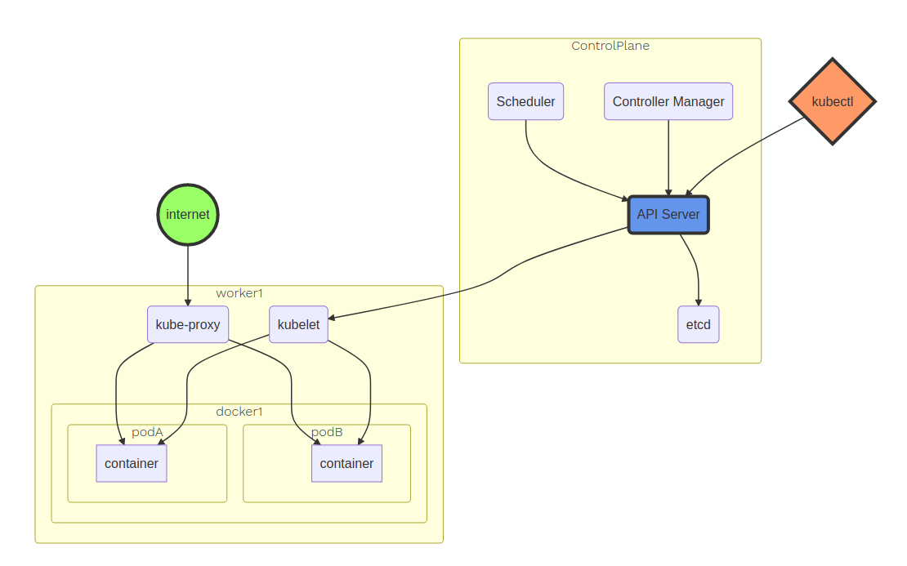
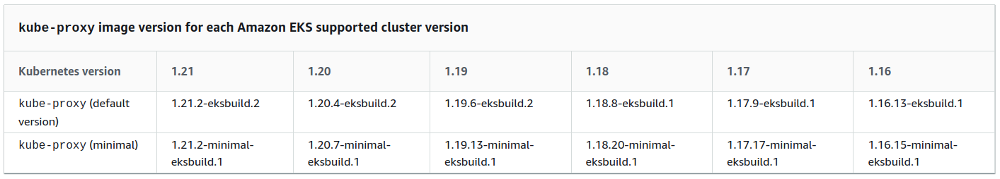
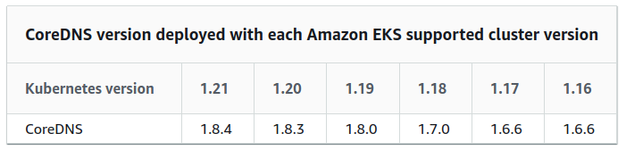

---
authors:
  - PaPu
categories:
  - devops
date: 2021-10-28
draft: false
---

# Upgrade eks version

- This doc is about upgrade kubernetes version on AWS (eks).
- Official guide is [here](https://docs.aws.amazon.com/eks/latest/userguide/update-cluster.html)
- Other useful resource:
  - [eksworkshop.com](https://www.eksworkshop.com/010_introduction/architecture/architecture_control_and_data_overview/)
  - [AWS EKS running out of IP address](https://medium.com/codex/kubernetes-cluster-running-out-of-ip-addresses-on-aws-eks-c7b8e5dd8606)
  - [Optimize EKS networking for scale](https://engineering.salesforce.com/optimizing-eks-networking-for-scale-1325706c8f6d)

## Prepare

- Change to right cluster, which you to upgrade version with commands:

```linenums="1"
    $ kubectl config get-contexts
    $ kubectl config use-context <context-name>
    Switched to context "<context-name>".
```

## K8s components



- We have some components need to be consider when we upgrade k8s version: `control plane`, `node group (aka: data plane)`, `VPC CNI`, `Core DNS` and `kube-proxy`

- Process upgrade (on official link is): `control plane` --> `node group` -> `VPC CNI`, `Core DNS` and `kube-proxy`.
- But some other guides follow process: `control plane` --> `VPC CNI`, `Core DNS` and `kube-proxy` -> `node group`. I will follow this process.

## Upgrade k8s version

### Upgrade Control plane

- New k8s versions have significant changes. Make sure you test new version on dev environment before you update your production clusters. You can not downgrade.
- It required 5 free IPs. If you are not have enough available. Check `Increase available IP address` section below.

1. Compare k8s version of Control plane and k8s version of Data plane ( nodes group)

- Get k8s version of Control plane:

```linenums="1"
    $ kubectl version --short
    Client Version: v1.19.11
    Server Version: v1.19.13-eks-8df270
```

- Get k8s version of Data Plane:

```linenums="1"
    $ kubectl get nodes
    NAME                                              STATUS   ROLES    AGE   VERSION
    ip-10-100-0-92.ap-southeast-1.compute.internal    Ready    <none>   28d   v1.19.13-eks-f39f26
    ip-10-100-10-44.ap-southeast-1.compute.internal   Ready    <none>   12d   v1.19.13-eks-f39f26
```

- k8s can only support nodes that are one version behind. So if your nodes have one or more version behind. You need upgrade nodes's version before continue on upgrade control plane version.

2. Ensure that the proper pod security policies are in place to avoid any issues.

- You can check for the default policy with the following command:

```linenums="1"
    $ kubectl get psp eks.privileged
    NAME             PRIV   CAPS   SELINUX    RUNASUSER   FSGROUP    SUPGROUP   READONLYROOTFS   VOLUMES
    eks.privileged   true   *      RunAsAny   RunAsAny    RunAsAny   RunAsAny   false            *
```

- No error in output, it mean everything is ok. If you got error, see [here](https://docs.aws.amazon.com/eks/latest/userguide/pod-security-policy.html#default-psp) before you continue.

3. If you originally deployed your cluster on k8s 1.17 or earlier, then you may need to remove a discontinued term from your CoreDNS manifest.

- View [official docs](https://docs.aws.amazon.com/eks/latest/userguide/update-cluster.html) for detail

4. Update your cluster using `eksctl`, the AWS Management Console, or the AWS CLI

- **_IMPORTANT_**

```linenums="1"
    - You only can update one version at a time.
    - Control Plane and Node Plane are at the same version. After upgrade Control Plane, Data Plane will is one version behind Control Plane
    - If you upgrade from `1.16 to 1.17` and you have any AWS Fagate pods that have a `kubelet` version ealier than `1.16`, recycle your    Fagate first and you can upgrade Control Plane later
    -  Updating to new version may overwrite custom configurations
```

- For `eksctl` and `AWS CLI` please view [official docs](https://docs.aws.amazon.com/eks/latest/userguide/update-cluster.html)
- For `AWS console`:
  - Open the Amazon EKS console at https://console.aws.amazon.com/eks/home#/clusters.
  - Choose the name of the Amazon EKS cluster to update and choose Update cluster version.
  - For k8s version, select the version to update your cluster to and choose Update.
  - For Cluster name, type the name of your cluster and choose Confirm.
  - The update takes several minutes to complete. ( Actually It may be take time to finish).

### Upgrade CNI, Core DNS and kube-proxy

#### Upgrade CNI

- You should aware you are using `AWS VPC CNI self-managed add-on` or `Amazon VPC CNI Amazon EKS add-on` (doc for upgrade Amazon EKS add-on [here](https://docs.aws.amazon.com/eks/latest/userguide/managing-vpc-cni.html#updating-vpc-cni-add-on)). These steps below are for self-managed add-on.

- Check latest version available on [github](https://github.com/aws/amazon-vpc-cni-k8s/blob/master/CHANGELOG.md)
- What is the current version:

```linenums="1"
    $ kubectl describe daemonset aws-node --namespace kube-system | grep Image | cut -d "/" -f 2
    amazon-k8s-cni:v1.6.3-eksbuild.1
```

- Should upgrade one version at a time. `1.7` -> `1.8` -> `1.9`

- If your regions are one of: `cn-north-1` , `cn-northwest-1` , `us-gov-east-1`, `us-gov-west-1` check the [offcial doc](https://docs.aws.amazon.com/eks/latest/userguide/managing-vpc-cni.html#updating-vpc-cni-add-on). If not follow steps below

- Download the manifest file:

```linenums="1"
    curl -o aws-k8s-cni.yaml https://raw.githubusercontent.com/aws/amazon-vpc-cni-k8s/release-1.9/config/v1.9/aws-k8s-cni.yaml
```

- Change to your region if it needed:

```linenums="1"
    sed -i.bak -e 's/us-west-2/<region-code>/' aws-k8s-cni.yaml
```

- May be you need change account from [here](https://docs.aws.amazon.com/eks/latest/userguide/add-ons-images.html) for your region. Current is `602401143452`

```linenums="1"
    sed -i.bak -e 's/602401143452/<account>/' aws-k8s-cni.yaml
```

- Apply the manifest file to your cluster:

```linenums="1"
    kubectl apply -f aws-k8s-cni.yaml
```

#### Upgrade kube-proxy

- Check compatible between k8s version and kube-proxy version in [here](https://docs.aws.amazon.com/eks/latest/userguide/managing-kube-proxy.html#kube-proxy-default-versions-table)

- 

- If you are using kube-proxy Amazon EKS add-on follow [this](https://docs.aws.amazon.com/eks/latest/userguide/managing-kube-proxy.html#updating-kube-proxy-eks-add-on)

- These step bellow is for kube-proxy self-managed add-on

- Check current version:

```linenums="1"
    $ kubectl get daemonset kube-proxy --namespace kube-system -o=jsonpath='{$.spec.template.spec.containers[:1].image}'
    602401143452.dkr.ecr.ap-southeast-1.amazonaws.com/eks/kube-proxy:v1.16.13-eksbuild.1
```

- Upgrade kube-proxy version. Change account `602401143452` with your output account, change region and version which compatible with k8s version:

```linenums="1"
    kubectl set image daemonset.apps/kube-proxy -n kube-system kube-proxy=602401143452.dkr.ecr.ap-southeast-1.amazonaws.com/eks/kube-proxy:v1.17.9-eksbuild.1
```

#### Upgrade Core DNS

- Check compatible between k8s version and CoreDNS in [here](https://docs.aws.amazon.com/eks/latest/userguide/managing-coredns.html#coredns-versions)

- 

- If you are using CoreDNS Amazon EKS add-on follow [this](https://docs.aws.amazon.com/eks/latest/userguide/managing-coredns.html#updating-coredns-eks-add-on)

- These step bellow is for CoreDNS self-managed add-on

- Check current version:

```linenums="1"
    kubectl describe deployment coredns --namespace kube-system | grep Image | cut -d "/" -f 3
    coredns:v1.6.6-eksbuild.1
```

- Retrieve your current CoreDNS image

```linenums="1"
     kubectl get deployment coredns --namespace kube-system -o=jsonpath='{$.spec.template.spec.containers[:1].image}'
    602401143452.dkr.ecr.ap-southeast-1.amazonaws.com/eks/coredns:v1.6.6-eksbuild.1
```

- If upgrade to `1.8.3` , add the `endpointslices` permission is needed.

```linenums="1"
    kubectl edit clusterrole system:coredns -n kube-system
```

- Add the following line to file:

```linenums="1"
    - apiGroups:
        - discovery.k8s.io
        resources:
        - endpointslices
        verbs:
        - list
        - watch
```

- Update CoreDNS by replacing `602401143452` with above step, and right CoreDNS version in command below:

```linenums="1"
  kubectl set image --namespace kube-system deployment.apps/coredns coredns=602401143452.dkr.ecr.ap-southeast-1.amazonaws.com/eks/coredns:v1.7.0-eksbuild.1
```

### Upgrade Data Plane ( nodes group)

- Go to AWS console and upgrade your Data Plane.

- If you deployed `Cluster Autoscaler` to your cluster. Update `Cluster Autoscaler` first.
- Check [here](https://github.com/kubernetes/autoscaler/releases) for latest compatible version.
- Replace `1.21.n` with right version on step above:

```linenums="1"
  kubectl -n kube-system set image deployment.apps/cluster-autoscaler cluster-autoscaler=k8s.gcr.io/autoscaling/cluster-autoscaler:v1.21.n
```

### Increase available IP address

- If you do not have enough free IPs (5 IPs). May be the reason is nodes group kept reserve IPs. Now you need config `WARM_IP_TARGET` to get more free IPs.
- You can check [official](https://docs.aws.amazon.com/eks/latest/userguide/cni-increase-ip-addresses.html) to get more IPs.
- Other links help to understand what parameters is:

  - [AWS EKS running out of IP address](https://medium.com/codex/kubernetes-cluster-running-out-of-ip-addresses-on-aws-eks-c7b8e5dd8606)
  - [Optimize EKS networking for scale](https://engineering.salesforce.com/optimizing-eks-networking-for-scale-1325706c8f6d)

- **_NOTE_**
  - Pros when you customize `WARM_IP_TARGET`:
    - very little setting change to your EKS k8s cluster.
    - Take effect immediately.
  - Cons:
    - It will increase the number of AWS EC2 API when attaching and deaching IP address. So you should only get just enough needed IPs.
    - For example if you have a lot cronjob in cluster. Cronjob pods are created and quit frequently, and your EC2 have low reserve IPs which could cause alots AWS EC2 API calls for handling IP address locations.
