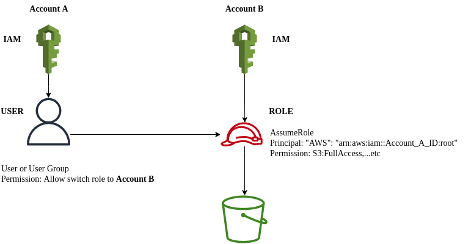

---
authors:
  - PaPu
categories:
  - devops
date: 2021-12-01
draft: false
---

# AWS switch link role

- Bài toán:

  - Giả sử bạn có một AWS account (`account A`), khách hàng của bạn có một aws account khác (`account B`). Vấn đề giờ bạn muốn truy cập S3 của khách hàng nhưng từ account A của bạn? How :D
  - Một `use case` khác mình gặp trong dự án thực tế. Khách hàng có 1 aws account (root account) mọi user tạo cho devops team hay dev, QA team truy cập aws console đều tạo trên IAM của account root này ( quản lý tập trung). Và tùy theo dự án KHG sẽ có rất nhiều các aws account khác ( tương ứng với từng dự - để dễ quản lý billing). Ví dụ 1 aws root account, và có 2 project là `b2b` và `shopping` thì sẽ có thêm 2 aws account (hay còn gọi sub account). Tất cả user tạo cho dev, devops, QA... đều tạo trên root account. Người dùng phải đăng nhập theo root account rồi switch link để đăng nhập sang `b2b` hay `shopping`.

- Quay trở lại bài toán. Vậy thứ tự cần đề user trên `account A` có thể truy cập `S3` trên `account B` gồm những gì ?
  - 
  - Account B tạo Role với `trusted entity` là `another AWS account` - điền `account_ID_A` và permission là những quyền gì bạn muốn chia sẻ cho `account A`.
    - Trusted entity sau khi tạo sẽ ntn:

```linenums="1"
{
  "Version": "2012-10-17",
  "Statement": [
    {
      "Effect": "Allow",
      "Principal": {
        "AWS": "arn:aws:iam::account_ID_A:root"
      },
      "Action": "sts:AssumeRole",
      "Condition": {}
    }
  ]
}
```

    - Nếu bạn share full quyền S3, permission sẽ như thế này(permission trong role được tạo trên):

```linenums="1"
{
    "Version": "2012-10-17",
    "Statement": [
        {
            "Effect": "Allow",
            "Action": [
                "s3:*",
                "s3-object-lambda:*"
            ],
            "Resource": "*"
        }
    ]
}
```

- Sau khi `account B` tạo role và gửi cho người quản lý `account A` thì không phải ai cũng có thể truy cập S3 của `account B` được. Trên `account A` cần thêm một bước nữa. Bạn cần tạo permission switch role và gán cho user hoặc group bạn muốn. Permission trông sẽ ntn:

```linenums="1"
  {
    "Version": "2012-10-17",
    "Statement": {
        "Effect": "Allow",
        "Action": "sts:AssumeRole",
        "Resource": [
            "arn:aws:iam::account_ID_B:role/<role_name_created_on_account_B>",
        ]
    }
  }
```

- Ok! sau đó thì user trên account A với permission trên sẽ có thể truy cập S3 (và các resource khác miễn được assign vào role) của account B.

- Happy working!!!
