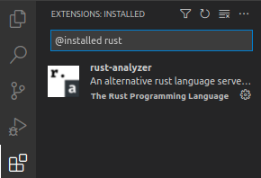
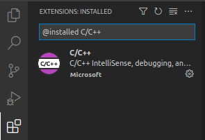
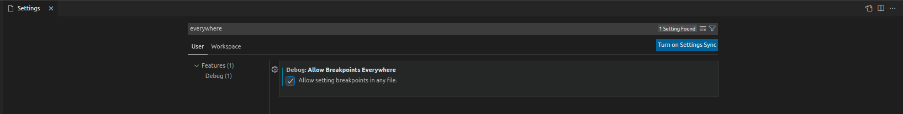
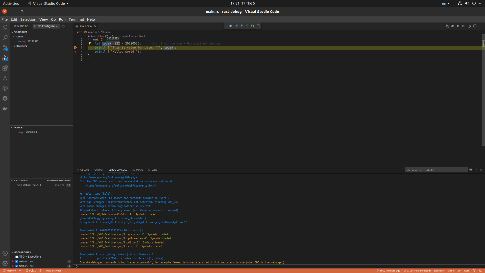

# Debug Rust trên [`vscode`](https://code.visualstudio.com/docs/languages/rust#_debugging)

## Installing

- Cài đặt [rust-analyzer](https://marketplace.visualstudio.com/items?itemName=rust-lang.rust-analyzer) extension để code và debug Rust trên `vscode` được tốt hơn.
- 

## Debugginng

- Để debug Rust chúng ta phải cài đặt một trong hai extension sau hỗ trợ cho việc debug:

  - [M$ C++](https://marketplace.visualstudio.com/items?itemName=ms-vscode.cpptools)
    - 
  - [CodeLLDB](https://marketplace.visualstudio.com/items?itemName=vadimcn.vscode-lldb)

- Do `M$ C++` có nhiều lượt tải hơn ( đương nhiên rồi) nên mình chọn cài extension này.

- Bạn sẽ cần enable: `Debug: Allow Breakpoints Everywhere` khi nhấn `Ctrl + ,` và search với từ khóa: `everywhere`
- 

- Ok sau khi cài 2 extension [rust-analyzer](https://marketplace.visualstudio.com/items?itemName=rust-lang.rust-analyzer) và [M$ C++](https://marketplace.visualstudio.com/items?itemName=ms-vscode.cpptools) hoặc [CodeLLDB](https://marketplace.visualstudio.com/items?itemName=vadimcn.vscode-lldb) , công thệm enable `Debug` bây giờ bạn có thể đặt break point trên code Rust được rồi đó :D

- 

---

#### HAPPY CODING!!!
