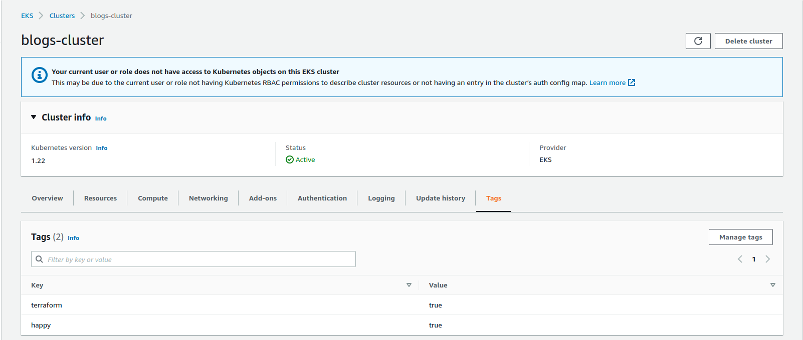

# Deploy an eks cluster using terraform

- Bài gốc [ở đây](https://www.techtarget.com/searchcloudcomputing/tutorial/How-to-deploy-an-EKS-cluster-using-Terraform)

## Deploy an eks cluster with terraform

- Trước khi bắt đầu chúng ta cần một số thứ sau:
  - một AWS account ( bài này mình account quyền admin :v)
  - quyền IAM (of cause account admin cơ mà)
  - VPC cho EKS ( chưa phải môi trường pro nên mình dùng luôn VPC default)
  - Kiến thức cơ bản về AWS: iam, role, policies, ec2...

## main.tf

- thêm `aws` provider:

```linenums="1"
terraform {
 required_providers {
  aws = {
   source = "hashicorp/aws"
  }
 }
}
```

- Cài đặt IAM role:

```linenums="1"
resource "aws_iam_role" "eks-iam-role" {
 name = "devopsthehardway-eks-iam-role"

 path = "/"

 assume_role_policy = <<EOF
{
 "Version": "2012-10-17",
 "Statement": [
  {
   "Effect": "Allow",
   "Principal": {
    "Service": "eks.amazonaws.com"
   },
   "Action": "sts:AssumeRole"
  }
 ]
}
EOF

}
```

- Đính kèm 2 policies dưới đây vào role:
  - Các polices này cho phép eks access vào EC2 ( nơi mà các worker node sẽ chạy).

```linenums="1"
resource "aws_iam_role_policy_attachment" "AmazonEKSClusterPolicy" {
 policy_arn = "arn:aws:iam::aws:policy/AmazonEKSClusterPolicy"
 role    = aws_iam_role.eks-iam-role.name
}
resource "aws_iam_role_policy_attachment" "AmazonEC2ContainerRegistryReadOnly-EKS" {
 policy_arn = "arn:aws:iam::aws:policy/AmazonEC2ContainerRegistryReadOnly"
 role    = aws_iam_role.eks-iam-role.name
}
```

- Tạo cluster:

```linenums="1"
resource "aws_eks_cluster" "blogs-eks" {
 name = "blogs-cluster"
 role_arn = aws_iam_role.eks-iam-role.arn

 vpc_config {
  subnet_ids = [var.subnet_id_1, var.subnet_id_2, var.subnet_id_3]
 }

 depends_on = [
  aws_iam_role.eks-iam-role,
 ]
}

output "endpoint" {
  value = aws_eks_cluster.blogs-eks.endpoint
}

output "kubeconfig-certificate-authority-data" {
  value = aws_eks_cluster.blogs-eks.certificate_authority[0].data
}
```

- Cài đặt polices cho worker nodes, bao gồm các policy:
  - AmazonEKSWorkerNodePolicy
  - AmazonEKS_CNI_Policy
  - EC2InstanceProfileForImageBuilderECRContainerBuilds
  - AmazonEC2ContainerRegistryReadOnly

```linenums="1"
resource "aws_iam_role" "workernodes" {
  name = "eks-node-group"

  assume_role_policy = jsonencode({
   Statement = [{
    Action = "sts:AssumeRole"
    Effect = "Allow"
    Principal = {
     Service = "ec2.amazonaws.com"
    }
   }]
   Version = "2012-10-17"
  })
}

resource "aws_iam_role_policy_attachment" "AmazonEKSWorkerNodePolicy" {
  policy_arn = "arn:aws:iam::aws:policy/AmazonEKSWorkerNodePolicy"
  role    = aws_iam_role.workernodes.name
}

resource "aws_iam_role_policy_attachment" "AmazonEKS_CNI_Policy" {
  policy_arn = "arn:aws:iam::aws:policy/AmazonEKS_CNI_Policy"
  role    = aws_iam_role.workernodes.name
}

resource "aws_iam_role_policy_attachment" "EC2InstanceProfileForImageBuilderECRContainerBuilds" {
  policy_arn = "arn:aws:iam::aws:policy/EC2InstanceProfileForImageBuilderECRContainerBuilds"
  role    = aws_iam_role.workernodes.name
}

resource "aws_iam_role_policy_attachment" "AmazonEC2ContainerRegistryReadOnly" {
  policy_arn = "arn:aws:iam::aws:policy/AmazonEC2ContainerRegistryReadOnly"
  role    = aws_iam_role.workernodes.name
}
```

- Tạo worker nodes, do mục đích test nên mình chỉ tạo 1 nodes group. Với môi trường production nên tạo ít nhất 3 group:

```linenums="1"
resource "aws_eks_node_group" "worker-node-group" {
  cluster_name  = aws_eks_cluster.blogs-eks.name
  node_group_name = "blogs-workernodes-internet-facing"
  node_role_arn  = aws_iam_role.workernodes.arn
  subnet_ids   = [var.subnet_id_1, var.subnet_id_2, var.subnet_id_3]
  instance_types = ["t3.xlarge"]

  scaling_config {
   desired_size = 1
   max_size   = 1
   min_size   = 1
  }

  depends_on = [
   aws_iam_role_policy_attachment.AmazonEKSWorkerNodePolicy,
   aws_iam_role_policy_attachment.AmazonEKS_CNI_Policy,
   #aws_iam_role_policy_attachment.AmazonEC2ContainerRegistryReadOnly,
  ]
}
```

- Full file [here](./0628-terraform-eks-main.tf)

## variables.tf

- Tạo file `variables.tf` và điền các tham số cho subnets. Ở đây mình dùng vpc mặc định. Môi trường production cần xem xét tạo VPC với các dải subnet được quy hoạch rõ ràng và các public, private subnet.

```linenums="1"
variable "subnet_id_1" {
  type = string
  default = "subnet-0ff14369"
}

variable "subnet_id_2" {
  type = string
  default = "subnet-7d49ea35"
}

variable "subnet_id_3" {
  type = string
  default = "subnet-b88ee0e1"
}
```

## Create eks

- `terraform init` để khởi tạo.
- `terraform plan` để kiểm tra những gì sẽ được thực hiện ( thêm sửa xóa hạ tầng).
- `terraform apply` sau đó nhập: `yes` để tạo mới eks. Ngoài ra có thể thêm option: `--auto-approve` để bỏ qua bước xác nhận nhưng mình nghĩ ko nên ( hãy nhìn qua 1 lần nữa cho chắc).

## Final result:



## Next time I should translate [this](https://calvineotieno010.medium.com/devops-automation-with-terraform-aws-and-docker-build-production-grade-eks-cluster-with-ec8fbfa269c9), it's seem a good one.

## HAPPY DEVOPS
