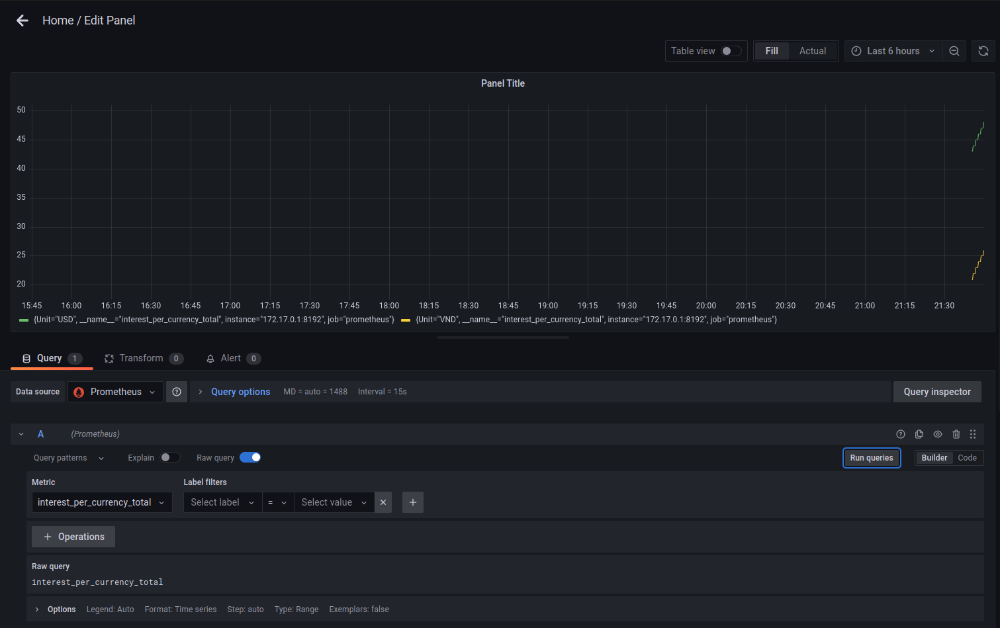
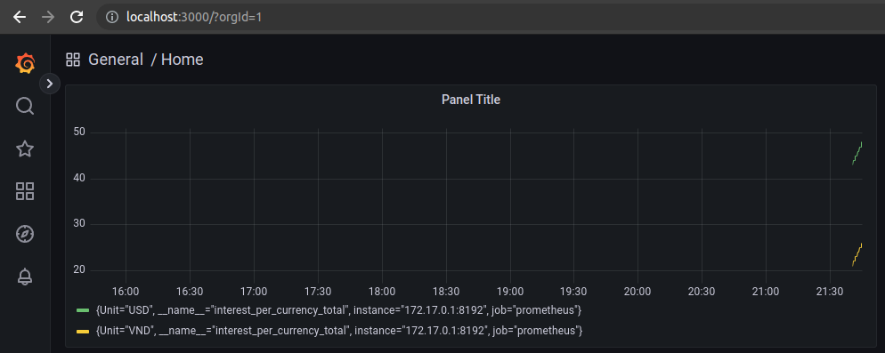

---
authors:
  - PaPu
categories:
  - devops
date: 2023-02-21
draft: false
---

# Monitor everything with prometheus, grafana and python exporter

- Prometheus và grafana thì khỏi nói rồi, monitor cơ số thứ và các node exporter có sẵn rất nhiều chỉ việc cài vào là có thể monitor.

- Tuy nhiên đôi khi chúng ta cần monitor những thứ không có sẵn đơn giản ví dụ chúng ta có thể monitor redis server, nhưng nếu muốn monitor giá trị của key `current_users` trong redis ( thay vì trạng thái server thì làm sao)?. Trong bài này mình sẽ note lại các bước dùng python custom metric của prometheus để monitor bất kỳ thứ gì chúng ta muốn.

## Python custom metric

- Chi tiết python exporter có thể xem tại [đây](https://github.com/prometheus/client_python). Một số kiểu metric của prometheus:
  - counter
  - gauge
  - summary
  - histogram
  - info
  - enum
- Prometheus có một thứ khá tuyệt trong metric đó là label. Ví dụ dưới đây mình sẽ tạo một metric là `currency` để monitor số tiền của mình, nhưng chúng ta sẽ có 2 label của metric này là: `VND` cho Việt Nam Đồng và là `USD` cho Đô La Mỹ.

- Source code python như dưới:

```python linenums="1"
import schedule
import time
from prometheus_client import start_http_server, Counter

currency = Counter('interest_per_currency', "số tiền hiện có", ['Unit'])
currency.labels("VND").inc(1)
currency.labels("USD").inc(23)


def job():
    currency.labels("VND").inc(1)
    currency.labels("USD").inc(1)


# schedule.every(1).minutes.do(job)
# schedule.every().day.at("19:00").do(job)


def main():
    start_http_server(8192)
    while True:
        job()
        time.sleep(60)


main()
```

- Chúng ta có thể dùng `schedule` để lập lịch chạy job tính toán lại metric vào thời gian cụ thể hoặc cứ sau mỗi một khoảng thời gian. Ví dụ này chưa dùng tới nhưng trong lúc custom metric thật cho công việc có thể dùng tới nên mình note luôn lại ở đây.

- Ví dụ này mình custom 1 metric tên `currency` với 2 label cho `VND` và `USD`. Với giá trị khởi điểm là 1 VND và 23 USD. Cứ 1 phút giá trị lại tăng lên 1.

- Sau khi cài đặt thư viện chạy source code và truy cập `localhost:8192` để lấy metric. Như dưới mình dùng curl để lấy giá trị:

```terminal linenums="1"

$curl localhost:8192 | grep currency
  % Total    % Received % Xferd  Average Speed   Time    Time     Time  Current
                                 Dload  Upload   Total   Spent    Left  Speed
100  2314  100  2314    0     0  2259k      0 --:--:-- --:--:-- --:--:-- 2259k
# HELP interest_per_currency_total số tiền hiện có
# TYPE interest_per_currency_total counter
interest_per_currency_total{Unit="VND"} 2.0
interest_per_currency_total{Unit="USD"} 24.0
```

## Prometheus and Grafana

- Okie metric thì đã tùy biến xong, tiếp theo chúng ta sẽ cài đặt và cấu hình prometheus và grafana

### Install prometheus and grafana

- Để cho nhanh chóng thì mình sẽ setup `docker-compose.yml` cho prometheus và grafana như dưới và `docker compose up -d` cho lẹ.

```yml linenums="1"
version: "2"

services:
  prometheus:
    image: prom/prometheus:v2.42.0
    container_name: prometheus_server
    hostname: prometheus_server
    volumes:
      - "./prometheus.yml:/etc/prometheus/prometheus.yml"
    ports:
      - "9090:9090"
  grafana: # default user/pass: admin/admin
    image: grafana/grafana:9.3.6
    container_name: grafana_server
    hostname: grafana_server
    ports:
      - "3000:3000"
    depends_on:
      - prometheus
```

- Thiết lập cấu hình cho prometheus như dưới `prometheus.yml`:

```yml linenums="1"
# my global config
global:
  scrape_interval: 15s # Set the scrape interval to every 15 seconds. Default is every 1 minute.
  evaluation_interval: 15s # Evaluate rules every 15 seconds. The default is every 1 minute.
  # scrape_timeout is set to the global default (10s).

# Alertmanager configuration
alerting:
  alertmanagers:
    - static_configs:
        - targets:
          # - alertmanager:9093

# Load rules once and periodically evaluate them according to the global 'evaluation_interval'.
rule_files:
  # - "first_rules.yml"
  # - "second_rules.yml"

# A scrape configuration containing exactly one endpoint to scrape:
# Here it's Prometheus itself.
scrape_configs:
  # The job name is added as a label `job=<job_name>` to any timeseries scraped from this config.
  - job_name: "prometheus"
    metrics_path: "/"

    # metrics_path defaults to '/metrics'
    # scheme defaults to 'http'.

    static_configs:
      - targets: ["172.17.0.1:8192"]
```

- Note chúng ta sẽ cài prometheus và grafana với version cụ thể và setup cấu hình mặc định cho prometheus. Phần `scrape_configs` là cấu hình cần thêm để prometheus sẽ lấy metric từ source code python lúc nãy:

```yml linenums="1"
scrape_configs:
  # The job name is added as a label `job=<job_name>` to any timeseries scraped from this config.
  - job_name: "prometheus"
    metrics_path: "/"

    # metrics_path defaults to '/metrics'
    # scheme defaults to 'http'.

    static_configs:
      - targets: ["172.17.0.1:8192"]
```

### Setup prometheus và grafana

- File `prometheus.yml` trên đã cấu hình sẵn prometheus để lấy metric từ python rồi nên ko cần làm gì thêm nữa. `172.17.0.1` là IP máy chạy source code python.

- Tên truy cập mặc định của grafana là `admin/admin`. Do demo nên skip luôn ko cần đổi pass mới.

- Cần setup Grafana để lấy dữ liệu từ prometheus và hiển thị. Đoạn này hơi cấn một chút. Do mình chạy docker-compose nên đoạn này cấu hình `Data source` cho grafana ko nhập localhost được mà cần nhập IP máy chạy docker-compose. Như đang demo sẽ là: `http://172.17.0.1:9090`

- Sau khi `Data source` work. Chúng ta khởi tạo Panel với metric như trong hình: 

- Ở đây mình tạo metric counter `interest_per_currency` nó bị thêm cái `_total` :D. Nếu metric là `Gauge` thì nó sẽ dữ nguyên tên.

- Ok done như vậy là với 1 metric chúng ta có thể cùng lúc monitor được nhiều giá trị với các ý nghĩa khác nhau như `VND` và `USD` như hình dưới, prometheus thật tuyệt :D



- HAPPY _dev_ and _devops_ :D !!!

- P/S: à quên giải phóng tài nguyên. `Ctrl + C` tắt code python đang chạy. Và `docker-compose down` để giải phóng sạch sẽ các tài nguyên docker lúc nãy vừa tạo nhé.
