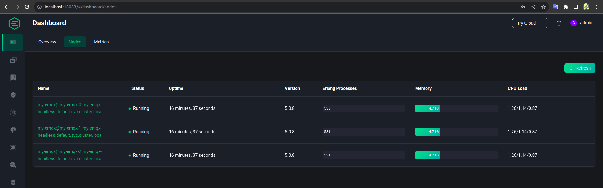
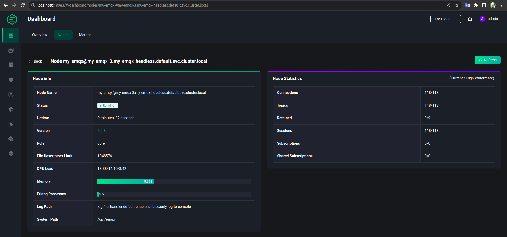

# MQTT benchmark on k8s

- Mình join support BID 1 dự án, và về lý thuyết MQTT support scale và loadbalancing (chi tiết xem doc EMQX: [configure load balancer](https://www.emqx.io/docs/en/v5.0/deploy/cluster/lb.html#configure-haproxy-nginx-in-emqx) ) nhưng để chắc chắn mình cần test trước để biết behavior của nó là như thế nào sau đó estimate mới chuẩn được.

## Server estimate

- EMQX có [server estimate](https://www.emqx.com/en/server-estimate) ở đây. Tức sẽ estimate cho mình với resource của server như nào ( ví dụ 1 CPU, 1G RAM) mình sẽ phục vụ được bao nhiêu connection và pub&sub TPS (total per second).

- Nên mình cũng test lại xem pub&sub thực tế có giống như trang của EMQX đưa ra ko( còn nhiều tham số khác ảnh hưởng đến kết quả test mà EMQX chưa đưa ra nên cần test lại ví dụ như đã off SSL chưa, size của mess là lớn hay nhỏ: các tham số này đều ảnh hưởng đến kết quả bao nhiêu pub&sub cùng lúc)

- Trang chủ EMQX có sẵn [docker-compose](https://www.emqx.io/docs/en/v5.0/deploy/install-docker.html#use-docker-compose-to-build-an-emqx-cluster) cho EMQX cluster. Paste lại đây trong trường hợp link chết :D

```yml linenums="1" title="docker-compose.yml"
version: "3"

services:
  emqx1:
    image: emqx:5.0.26
    container_name: emqx1
    environment:
      - "EMQX_NODE_NAME=emqx@node1.emqx.io"
      - "EMQX_CLUSTER__DISCOVERY_STRATEGY=static"
      - "EMQX_CLUSTER__STATIC__SEEDS=[emqx@node1.emqx.io,emqx@node2.emqx.io]"
    healthcheck:
      test: ["CMD", "/opt/emqx/bin/emqx_ctl", "status"]
      interval: 5s
      timeout: 25s
      retries: 5
    networks:
      emqx-bridge:
        aliases:
          - node1.emqx.io
    ports:
      - 1883:1883
      - 8083:8083
      - 8084:8084
      - 8883:8883
      - 18083:18083
    # volumes:
    #   - $PWD/emqx1_data:/opt/emqx/data

  emqx2:
    image: emqx:5.0.26
    container_name: emqx2
    environment:
      - "EMQX_NODE_NAME=emqx@node2.emqx.io"
      - "EMQX_CLUSTER__DISCOVERY_STRATEGY=static"
      - "EMQX_CLUSTER__STATIC__SEEDS=[emqx@node1.emqx.io,emqx@node2.emqx.io]"
    healthcheck:
      test: ["CMD", "/opt/emqx/bin/emqx_ctl", "status"]
      interval: 5s
      timeout: 25s
      retries: 5
    networks:
      emqx-bridge:
        aliases:
          - node2.emqx.io
    # volumes:
    #   - $PWD/emqx2_data:/opt/emqx/data

networks:
  emqx-bridge:
    driver: bridge
```

- `docker compose up -d` và thế là mình có 1 cluster EMQX để test rồi.
- Giờ đến test tải. EMQX cũng support sẵn dockerize cho việc bench connection, pub, sub chỉ việc docker run là có ở đây: [EMQTT-bench](https://hub.docker.com/r/emqx/emqtt-bench)

- Ví dụ giờ muốn test connection mình có thể chạy câu lệnh sau: `docker run -it emqx/emqtt-bench conn -c 50000 -i 10`

- BOOM nhưng \*ÉO. Sau khi chạy lệnh nó méo work. Dù docker-compose kia mình đã sửa để expose và port ra local (truy cập được dashboard) nhưng EMQTT-bench thì lại không work.

- Ngáo ngơ một hồi nhớ ra bản thân con EMQTT-bench cũng chạy trong container nên ko thể là `-h localhost`. Vì mình đã expose EMQTT cluster ra local nên giờ cần đổi `-h localhost` thành `-h host_IP`. Container EMQX-bench nhận localhost là localhost của nó chứ ko phải của host đang chạy docker.

- Ok sau khi đã sửa tham số và đã có thể test tải ok. Lệnh pub&sub trông sẽ ntn (nhớ thử với thông số nhỏ trước nhé vì có thể lỗi, thay bằng số lớn sau):

```linenums="1"
# pub 1
docker run -it emqx/emqtt-bench pub -c 1 -I 1 -t bench/%i -q 2 -h 10.20.0.232 -q 2

# pub 1k
docker run -it emqx/emqtt-bench pub -c 1000 -I 1000 -t bench/%i -h 10.20.0.232 -q 2

# sub 1k
docker run -it emqx/emqtt-bench sub -c 1000 -i 1000 -t bench/%i -q 2 -h 10.20.0.232 -q 2

```

- `10.20.0.232` là IP của host chạy docker được 1 EMQTT expose ra.
- Vấn đề phát sinh dù có 3 con EMQTT nhưng tải chỉ ăn 1 con (do mình expose 1 IP của node EMQX - nhưng dù có expose hết thì cũng chưa có biện pháp cân bằng tải nào ở đây cả). Phần tiếp theo check cân bằng tải

## Test cân bằng tải EMQX

### EMQX cluster

- Về mặt lý thuyết với docker-compose trên và hướng dẫn [configure load balancer](https://www.emqx.io/docs/en/v5.0/deploy/cluster/lb.html) có thể dùng nginx hoặc HA proxy để test loadbalancing. Nhưng loay hoay mãi méo thành công(cái này do mình kém - mà thôi méo có thời gian check). Trong khi KHG đang dùng helm và call internal service trong k8s nên mình quyết định test như của khách luôn :D

- Mình chạy minikube để có cụm k8s local. Và khách hàng dùng [helm](https://github.com/emqx/emqx/tree/master/deploy/charts/emqx#installing-the-chart) này để cài EMQX

- Kéo code về rồi sửa version trong Chart.yaml thành `5.0.8` như của khách rồi chạy thôi để có EMQX cluster trong k8s:

```linenums="1"
$ git clone https://github.com/emqx/emqx.git
$ cd emqx/deploy/charts/emqx
$ helm install my-emqx .

# Xoá đi test lại :D dùng:
$ helm del my-emqx
```

- Sau khi chờ 1 chút chúng ta sẽ có 3 pods ở namespace default (cấu hình trong `StatefulSets` không phải trong deployment đâu mà tìm :D)

- Để truy cập dashboard của EMQX chúng ta cần expose port của EMQX ra local với lệnh:

```linenums="1"
kubectl port-forward svc/my-emqx 18083:18083
```

- Note: máy mình chỉ có 1 config k8s (minikube) nếu máy có nhiều config của k8s cluster thì cần chọn lại đúng cluster mong muốn trước khi chạy kubectl (chạy như nào gg :D)
- Sau đó chúng ta có thể truy cập địa chỉ: `localhost:18083` để vào EMQX dashboard trông nó sẽ ntn:
  

### EMQX-bench

- Cluster EMQX có rồi giờ đến EMQX-bench. Đến phần khó: EMQX-bench trên docker hub hướng dẫn chạy với lệnh ví dụ:
  `docker run -it emqx/emqtt-bench conn -c 50000 -i 10` tức chạy container với images `emqx/emqtt-bench` với lệnh: `conn -c 50000 -i 10`.

- Giờ muốn chạy test pub/sub mình thử tạo deployment với lệnh tương ứng như trên nhưng ko work( ko tin thử thì biết :D)

- Sau đó nhớ ra có thể check docker entry point vì có thể nó đã bị thay đổi. (Cảm ơn Docker In Action - Mình biết trò này của docker qua quyển này - sẽ có một bài note lại về quyển này. Spoiler ko cần đọc hết cả quyển)

- Check ra thấy entry point đã bị thay đổi như này:

```linenums="1"
papu@cyber:~$ docker history emqx/emqtt-bench
IMAGE          CREATED        CREATED BY                                      SIZE      COMMENT
9c87dc50902a   8 weeks ago    CMD [""]                                        0B        buildkit.dockerfile.v0
<missing>      8 weeks ago    ENTRYPOINT ["/emqtt_bench/emqtt_bench"]         0B        buildkit.dockerfile.v0
<missing>      8 weeks ago    RUN /bin/sh -c make compile # buildkit          536MB     buildkit.dockerfile.v0
<missing>      8 weeks ago    WORKDIR /emqtt_bench                            0B        buildkit.dockerfile.v0
<missing>      8 weeks ago    COPY . /emqtt_bench # buildkit                  2.83MB    buildkit.dockerfile.v0
<missing>      2 months ago   CMD ["/bin/bash"]                               0B        buildkit.dockerfile.v0
<missing>      2 months ago   WORKDIR /                                       0B        buildkit.dockerfile.v0
<missing>      2 months ago   RUN |4 OTP_VERSION=25.3.2-1 ELIXIR_VERSION=1…   1.21MB    buildkit.dockerfile.v0
<missing>      2 months ago   ENV LUX_REF=lux-2.6                             0B        buildkit.dockerfile.v0
<missing>      2 months ago   ARG LUX_REF                                     0B        buildkit.dockerfile.v0
<missing>      2 months ago   RUN |3 OTP_VERSION=25.3.2-1 ELIXIR_VERSION=1…   9.13MB    buildkit.dockerfile.v0
<missing>      2 months ago   COPY get-emqtt-bench.sh /get-emqtt-bench.sh …   882B      buildkit.dockerfile.v0
<missing>      2 months ago   ARG EMQTT_BENCH_REF                             0B        buildkit.dockerfile.v0
<missing>      2 months ago   RUN |2 OTP_VERSION=25.3.2-1 ELIXIR_VERSION=1…   0B        buildkit.dockerfile.v0
<missing>      2 months ago   RUN |2 OTP_VERSION=25.3.2-1 ELIXIR_VERSION=1…   6.96MB    buildkit.dockerfile.v0
<missing>      2 months ago   COPY get-elixir.sh /get-elixir.sh # buildkit    786B      buildkit.dockerfile.v0
<missing>      2 months ago   ARG ELIXIR_VERSION                              0B        buildkit.dockerfile.v0
<missing>      2 months ago   RUN |1 OTP_VERSION=25.3.2-1 /bin/sh -c /get-…   156MB     buildkit.dockerfile.v0
<missing>      2 months ago   COPY get-otp.sh /get-otp.sh # buildkit          2.18kB    buildkit.dockerfile.v0
<missing>      2 months ago   ARG OTP_VERSION                                 0B        buildkit.dockerfile.v0
<missing>      2 months ago   ENV EMQX_BUILDER_IMAGE=                         0B        buildkit.dockerfile.v0
<missing>      2 months ago   CMD ["/bin/bash"]                               0B        buildkit.dockerfile.v0
<missing>      2 months ago   WORKDIR /                                       0B        buildkit.dockerfile.v0
<missing>      2 months ago   ENV LANG=C.UTF-8                                0B        buildkit.dockerfile.v0
<missing>      2 months ago   ENV LC_ALL=C.UTF-8                              0B        buildkit.dockerfile.v0
<missing>      2 months ago   RUN /bin/sh -c apt-get clean && rm -rf /var/…   0B        buildkit.dockerfile.v0
<missing>      2 months ago   RUN /bin/sh -c /get-cmake.sh build # buildkit   55.7MB    buildkit.dockerfile.v0
<missing>      2 months ago   COPY get-cmake.sh /get-cmake.sh # buildkit      800B      buildkit.dockerfile.v0
<missing>      2 months ago   RUN /bin/sh -c ln -sf /usr/bin/pip3 /usr/bin…   13B       buildkit.dockerfile.v0
<missing>      2 months ago   RUN /bin/sh -c ln -sf /usr/bin/python3 /usr/…   16B       buildkit.dockerfile.v0
<missing>      2 months ago   RUN /bin/sh -c apt-get install -y     krb5-k…   14.6MB    buildkit.dockerfile.v0
<missing>      2 months ago   RUN /bin/sh -c apt-get update && apt-get ins…   576MB     buildkit.dockerfile.v0
<missing>      2 months ago   ENV DEBIAN_FRONTEND=noninteractive              0B        buildkit.dockerfile.v0
<missing>      3 months ago   /bin/sh -c #(nop)  CMD ["bash"]                 0B
<missing>      3 months ago   /bin/sh -c #(nop) ADD file:b7c0be2bb90e88689…   124MB
```

- Để ý lệnh thứ 2: `ENTRYPOINT ["/emqtt_bench/emqtt_bench"]` đó entry point đã bị đổi mặc định sẽ chạy lệnh này tức cụm `conn -c 50000 -i 10` chỉ là tham số (arguments) thôi.

- Mình tạo luôn 2 file deployment apply cho nhanh (ko phải helm):

  - pub-deployment-EMQX-bench.yml:

```yaml linenums="1" title="pub-deployment-EMQX-bench.yml"
apiVersion: apps/v1
kind: Deployment
metadata:
  name: emqx-bench-deployment
  labels:
    app: emqx-bench
spec:
  replicas: 1
  selector:
    matchLabels:
      app: emqx-bench
  template:
    metadata:
      labels:
        app: emqx-bench
    spec:
      containers:
        - name: emqx-bench
          image: emqx/emqtt-bench:latest
          command:
            [
              "emqtt_bench",
              "pub",
              "-c",
              "500",
              "-I",
              "500",
              "-t",
              "bench/%i",
              "-q",
              "2",
              "-h",
              "my-emqx.default.svc.cluster.local",
            ]
```

- sub-deployment-EMQX-bench.yaml

```yaml linenums="1" title="sub-deployment-EMQX-bench.yaml"
apiVersion: apps/v1
kind: Deployment
metadata:
  name: emqx-bench-sub-deployment
  labels:
    app: emqx-bench
spec:
  replicas: 1
  selector:
    matchLabels:
      app: emqx-bench
  template:
    metadata:
      labels:
        app: emqx-bench
    spec:
      containers:
        - name: emqx-bench
          image: emqx/emqtt-bench:latest
          command:
            [
              "emqtt_bench",
              "sub",
              "-c",
              "500",
              "-i",
              "500",
              "-t",
              "bench/%i",
              "-q",
              "2",
              "-h",
              "my-emqx.default.svc.cluster.local",
            ]
```

- Note:

  - Trong file deployment mình đã thêm phần `command` để thực hiện việc bench test
  - Nếu đọc bạn sẽ thấy phần `-h` với giá trị: `my-emqx.default.svc.cluster.local` do pub và sub mình định deploy trong cùng 1 namespace (default) với emqx cluster.

- Khi chạy thử pub lên đã thấy share tải. (Mình thử mở thêm 1 pod EMQX trong EMQX cluster nữa( từ 3 lên 4) thì thấy mãi ko join cluster ( trước đó mình test join thành công). Check lỗi thấy liên quan port 18083. Tắt bỏ cái port forward ở trên thì join thành công. -> Cần lưu ý việc này khi test :D )

### Nhận xét

- Khi có 3 nodes trong EMQX cluster, và 1 pod của EMQX-bench thì có share tải. Nhưng khi mình scale tay lên node thứ 4 thì node 4 này ko chịu tải ( ko có request nào tới). Khi chạy thêm pod thứ hai của EMQX-bench thì node thứ 4 mới chịu tải ==> :

- 

- Việc scale phải setup trước khi quá tải, khi quá tải rồi add thêm node mới không có ý nghĩa với lượng tải hiện tại. Chỉ có ý nghĩa với những mess từ publisher mới.

- Nhìn vào số lượng topic và connection hơn 100 của node số 4 trong khi các node cũ > 200 ~ 300 -> việc cân bằng tải service của k8s ko thực sự chính xác ( nó ko có cách nào biết mỗi node đang chịu tải bao nhiêu), nó chỉ thực sự chia đều các mess mới đến. -> nếu muốn cân bằng tải khi auto scale cần nghiên cứu thêm. Server k8s chỉ chia để in comming mess thôi.

- Chắc tạm đến đây hehe

- **_ HAPPY WORKING!!!_**
