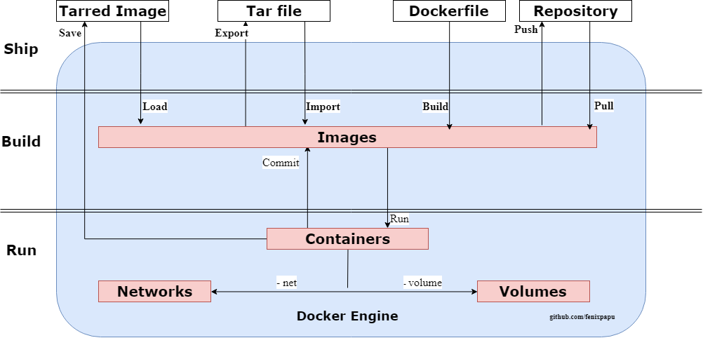

---
authors:
  - PaPu
categories:
  - devops
date: 2019-05-21
draft: false
---

# Exploring docker

## Mở đầu

Hi guys!
Là một người mới tìm hiểu `docker` và mới dừng ở run `container` từ `image` :D. Mình có lên trang web của docker để đọc [documentation](https://docs.docker.com/get-started/). Nhưng thấy khá dối vì có quá nhiều khái niệm: docker-something( docker-compose, docker-machine, docker engine, docker swarm, docker image, docker container...). Vì vậy mình quyết định không đọc tiếp documentation nữa. Mà sẽ tìm hiểu tổng quát qua các khái niệm của docker, để có cái nhìn bao quát trước khi đi vào chi tiết từng khái niệm. Đó cũng chính là nội dung của bài viết này sẽ trình bày. Ngoài khái niệm về định nghĩa, nội dung có viêt theo ý hiểu của cá nhân :)

<!-- more -->

## [Docker Engine](https://github.com/docker/engine)

- Là một lightweight runtime tool sẽ build và run các docker containers. Nó hoạt động như thế nào? Docker thực chất là một ứng dụng dạng client-sever. Docker Client sẽ giao tiếp với Docker Engine qua một RESTful API, để thực hiện việc build, ship và run các containers.

- Có bốn khái niệm chính trong thế giới Docker Engine - chúng đều có ID - bằng cách kết hợp chúng cùng nhau, chúng ta có thể build, ship và run ứng dụng, ở bất kỳ đâu([Docker — Build, Ship, and Run Any App, Anywhere.](https://www.docker.com/))

  - Images: image được sử dụng để đóng gói các ứng dụng và gói phụ thuộc. Hiểu nôm na `image` giống như một file .iso của bản cài hệ điều hành win10 hoặc ubuntu vậy. Có một số thứ liên quan bạn nên quan tâm đó là khi viết `Dockerfile` làm sao cho tối ưu ví dụ như [tạo ra image với kích thước nhỏ](https://docs.docker.com/develop/dev-best-practices/) hay [best-practices](https://docs.docker.com/develop/develop-images/dockerfile_best-practices/).

  - Containers. Container chính là một thể hiện của images. Hiểu nôm na như khi bạn cài thành công ubuntu/win10 lên laptop vậy.

  - Networks: Khi có nhiều container bận sẽ muốn gom chúng chung vào một network cho tiện quản lý hoặc tách biệt một nhóm các container với các dải mạng khác, bạn sẽ cần hiểu tìm hiểu khái niệm network trong Docker.

  - Volumes: Volumes được thiết kế để lưu dữ liệu, độc lập với vòng đời của containers - thế nghĩa là sao ? Thông thường chúng ta có thể lưu dữ liệu ngay trong containers kiểu thiết kế này làm containers bị phình to ra, và quan trọng hơn mỗi khi containers bị xóa, toàn bộ dữ liệu sẽ bị mất. Volumes sẽ giải quyết vấn đề này.

- Hình bên dưới mô tả cách thức các Docker Client trên hoạt động và tương tác với nhau:
  
  - Loằng ngoằng khó hiểu vậy? Mình sẽ nói qua một chút. Docker thực hiện chính các việc: `ship`, `build`, `run`. Trong hình trên chia ra 3 phần tương ứng cho các việc này.
  - Nhìn từ trên xuống ví dụ cho phần ship: từ `Dockerfile` chúng ta có thể build ra 1 `image` hoặc từ một `repository` chúng ta có thể `pull` về `images` hoặc ngược lại từ các `image` này chúng ta có thể `push` lên `repository` đó chính là `ship`.
  - Phần thứ 2 từ `images` chúng ta có thể `run` thành một `container` hoặc `container` chúng ta có thể `commit` để tạo ra images. Đó là phần `build`.
  - Phần cuối: trong quá trình `contaiers` được chạy. Nó sẽ có thể liên kết với nhau( `networks`) và lưu trữ giữ liệu đâu đó ngoài `container` (`volumes`) đó phần run của docker.

## Distribution tools( công cụ quản lý phân tán các images)

- Để lưu trữ và quản lý các Docker image chúng ta có các công cụ sau:
  - Docker Registry: là một mã nguồn mở giúp bạn tự lưu trữ và quản lý Docker images.
  - Docker Trusted Registry: là công cụ quản lý và lưu trữ images có tính phí( nếu bạn có nhu cầu thì có thể tìm hiểu thêm - mình hiện tại chưa có :D)
  - Docker Hub: Được cung cấp bởi docker, và mặc định docker Client sẽ sử dụng Docker Hub này nếu không có registry nào được cấu hình. Nếu đụng đến Docker chắc chắn bạn sẽ dùng dùng tới nó nhiều :D

## Orchestration tools ( công cụ điều phối)

- [Docker Machine](https://github.com/docker/machine): cho phép tạo Docker hots trên máy tính của bạn, dịch vụ cloud, trong datacenter. Docker tạo server và cài đặt Docker lên chúng, kế đến cấu hình để Docker Client có thể giao tiếp được với Docker server. Hiểu nôm na giúp dễ dàng cài đặt Docker-engine lên các môi trường.

- [Docker Swarm](https://github.com/docker/swarm): là một tool giúp phân cụm (clustering) cho Docker containers. Gom vài Docker Engines lại với nhau và expose chúng ra ngoài như một virtual Docker Engine. Swarm hỗ trợ chuẩn Docker API, bởi vậy tool nào kết nối với Docker Engine thì đều có thể sử dụng Swarm. Swarm cũng nên cấu hình và deployed với Docker Machine.

- [Docker compose](https://github.com/docker/compose): là tool cho việc định nghĩa và chạy nhiều docker-container. Ví dụ để `run` 10 container thay vì 10 lần lệnh. Giờ đây với cấu hình sẵn trước trong docker-compose.yml chúng ta chỉ cần chạy 1 lệnh: `docker-compose up`. (nhẹ nhàng hơn không? :D)

- Hơi có chút nhầm lẫn hoặc khó phân biệt giữ `docker-compose` và `docker-swarm` ?
  - `docker-compose` đơn giản cho phép cấu hình và start nhiều docker containers. Trong khi đó `docker-swarm` cho phép chạy và kết nối nhiều containers trên **_nhiều_** hosts. Nó quản lý việc chạy nhiều containers trên nhiều hosts khác nhau, quản lý việc mở rộng (scaling), chạy mới một containers khi có một containers bị crash, quản lý network trong các containers..

## Third party tools

- Ngoài ra còn có một số tools cho trong hệ sinh thái Docker bạn cũng nên biết qua:
  - **_Orchestration_** : như Kubernets hoặc Mesos Marathon.
  - **_Clustering_**: như Fleet hoặc Nomad.
  - **_Registries_**: như Quay.io hoặc Artifactory.
  - **_Managed container services_**: AWS ECS, Google Container Engine.

## Summing up

- Tool Docker cho phép build, ship, và run bất kỳ ứng dụng nào, ở bất kỳ đâu:
  - **_Build_**: `Docker Engine`( docker build -t) và `Docker Compose` (docker-compose build, các ứng dụng chạy nhiều container)
  - **_Ship_**: Docker Registry, Docker Trusted Registry, Docker Hub(SaaS)
  - **_Run_**: `Docker Engine`(Docker run), `Docker Swarm` (quản lý nhiều Docker Engine), `Docker Compose` (docker-compose up)
  - **_Manage_**: Docker Universal Control Plane và Docker Cloud(CaaS).
  - **_Provisioning of Docker Engines_**: Docker Machine, Docker Toolbox, Docker for Mac, Docker for Windows(với máy cá nhân)

## Kết

- Khi tìm hiểu viết bài này, giúp mình có cái nhìn tổng quan về Docker cũng như hiểu, phân biệt các khái niệm `Docker-something`.
- Giúp mình nhìn các phần trong documentation của Docker dễ dàng hơn, định hướng được mình đang đọc phần nào của docker, hoặc cần tìm cái gì ở đâu dễ dàng hơn.
- Chúc bạn có chung cảm nhận giống như mình!
