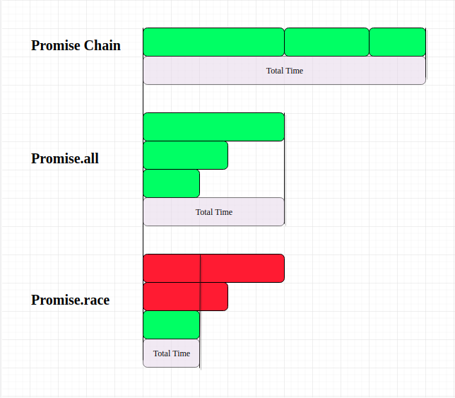

---
authors:
  - PaPu
categories:
  - dev
date: 2019-07-02
draft: false
---

# JS-ES6

## This

- JS là ngôn ngữ kịch bản, trình thông dịch sẽ đọc và thực thi code theo từng dòng. `Môi trường (enviroment- scope)` tại dòng đang được thực thi được gọi là `Excution Context`. `This` thay đổi mỗi khi `excution context` bị thay đổi. ([this in Javascript](https://medium.com/quick-code/understanding-the-this-keyword-in-javascript-cb76d4c7c5e8))

- Một cách dễ hình dung hơn: giá trị biến `this` phụ thuộc xem function được thực thi như thế nào, ở đâu và khi nào (how - when - where) không phải cách function đó được khai báo hoặc định nghĩa.

- Ví dụ `this` phụ thuộc how-when-where function được thực thi.
<!-- more -->

```javascript linenums="1"
// Where #######################################################

// in browser
this === window; // true

// in Node
this === global; // true

var name = "Global";

function printName() {
  console.log(this.name);
}

const objA = {
  name: "objA",
  printName: printName,
};

const objB = {
  name: "objB",
  printName: printName,
};
printName();
objA.printName();
objB.printName();

// How #######################################################
objA.printName.apply(objB);

// When #######################################################

const objA = {
  name: "objA",
  printName: function () {
    console.log(this.name);
  },
};

const objB = {
  name: "objB",
  printName: objA.printName,
};
```

- KL: `this` sẽ không được gán giá trị cho tới khi function nơi `this` định nghĩa `this` được thực thi.

## Apply - Call - Bind

- Với `apply` - `call` - `bind` chúng ta sẽ chỉ rõ `function` đang thực thi trên object nào?

```javascript linenums="1"
const person = {
  printName: function () {
    console.log(this.name);
  },
  printInfo: function (phone, age) {
    console.log(`name; ${this.name} - phone: ${phone} - age:  ${age}`);
  },
};

const personA = {
  name: "AAA",
};
person.printName.call(personA);
person.printName.apply(personA);
const bindA = person.printName.bind(personA);
bindA();

person.printInfo.call(personA, "789", 23);
person.printInfo.apply(personA, ["789", 23]);
const bindA = person.printInfo.bind(personA, "789", 23);
bindA();
```

## Closure

- Bài toán chúng ta muốn sử dụng một biến để đếm (counting) thứ gì đó, và counter này phải có thể truy xuất bởi tất cả các hàm.

```javascript linenums="1"
// Initiate counter
var counter = 0;

// Function to increment counter
function add() {
  counter += 1;
}

// Call add() 3 times
add();
add();
add();

// The counter should now be 3
```

- Có 1 vấn đề với giải pháp trên. Bất kỳ đoạn code nào cũng có thể thay đổi giá trị biến counter. Mà không cần gọi tới add();

- Chúng ta cũng không thể cho biến counter vào trong add được. Bởi nó `local` và giá trị counter sẽ bị reset mỗi khi add được gọi.

- Inner function(closures) có thể giải quyết bài toán này.

```javascript linenums="1"
const myClosure = () => {
  let counter = 0;
  return () => {
    counter += 1;
    return counter;
  };
};
const add = myClosure();
add();
add();
add();

const myFirstInner = myClosure();
const mySecondInner = myClosure();
```

- Có thể sử dụng `closure` cho như việc cung cấp private properties của object.

## Callback

- Function được truyền vào như tham số của function khác: `callback function`

```javascript linenums="1"
const printContext = (txt) => {
  console.log(txt);
};
const sayHello = (mess, cb) => {
  cb(mess);
};
sayHello("Happy Monday!!!!", printContext);
```

- Tại sao cần callback:

  - Browser khi request thông tin từ server trong thời gian chờ không thể để giao diện bị treo tại đó được. Cần thực hiện việc khác luôn và khi có dữ liệu thì sẽ fill lên giao diện sau.
  - Phía server đây là điểm mạnh của Node giúp Node có thể xử lý cùng lúc nhiều request từ phía client ( lý do dùng node).

- Điểm lưu ý `callback` callback-hell

```javascript linenums="1"
const verifyUser = function (username, password, callback) {
  dataBase.verifyUser(username, password, (error, userInfo) => {
    if (error) {
      callback(error);
    } else {
      dataBase.getRoles(username, (error, roles) => {
        if (error) {
          callback(error);
        } else {
          dataBase.logAccess(username, (error) => {
            if (error) {
              callback(error);
            } else {
              callback(null, userInfo, roles);
            }
          });
        }
      });
    }
  });
};
```

- Remind `setTimeOut`:

```javascript linenums="1"
setTimeout(() => console.log("Hi Im setTimeout"), 5000);
```

## Promise

- Promise được đưa vào JS từ ES6 được coi một kỹ thuật giúp xử lý vấn đề bất đồng bộ hiệu quả hơn.

```javascript linenums="1"
let myPromise = new Promise((resolve, reject) => {
  // do something here. Example get data from db;
  const isSuccess = true;
  if (isSuccess) return resolve("success");
  return reject("Error");
});
myPromise
  .then((data) => {
    console.log("send to client");
  })
  .catch((err) => {
    console.log("handled error", err);
  });

// Question
let myFirstPromise = new Promise((resolve, reject) => {
  // do something here success and return;
  return resolve(`userInfo`);
});
let mySecondPromise = new Promise((resolve, reject) => {
  // do something here failed and return;
  return reject(`ERROR mat roi!`);
});

myFirstPromise
  .then((data) => {
    console.log(`myFirstPromise: ${data}`);
  })
  .catch((err) => {
    console.log(`myFirstPromise error content: ${err}`);
  });
mySecondPromise
  .then((data) => {
    console.log(`mySecondPromise: ${data}`);
  })
  .catch((err) => {
    console.log(`mySecondPromise error content: ${err}`);
  });

const delay = (ms) => {
  return new Promise((resolve, reject) => {
    setTimeout(() => {
      return resolve("success");
    }, ms);
  });
};
```

- Promise chain vs Promise.all and Promise.race

```javascript linenums="1"
const myFirstPromise = (data) => {
  return new Promise((resolve, reject) => {
    console.log("Data receive in myFirstPromise: ", data);
    return resolve("1111");
  });
};

const mySecondPromise = (data) => {
  return new Promise((resolve, reject) => {
    console.log("Data received in mySecondPromise: ", data);
    return resolve("2222");
  });
};

const myThirdPromise = (data) => {
  return new Promise((resolve, reject) => {
    console.log("Data received in myThirdPromise: ", data);
    return resolve("3333");
  });
};

myFirstPromise("started")
  .then((firstData) => {
    return mySecondPromise(firstData);
  })
  .then((secondData) => {
    return myThirdPromise(secondData);
  })
  .then((thidData) => {
    console.log(`return from myThirdPromise: ${thidData}`);
  })
  .catch((err) => {
    console.log("handled err");
  });

Promise.all([myFirstPromise(), mySecondPromise(), myThirdPromise()])
  .then((data) => {
    console.log(data);
  })
  .catch((err) => cosole.log("err haneld"));

Promise.race([myFirstPromise(), mySecondPromise(), myThirdPromise()])
  .then((data) => {
    console.log(data);
  })
  .catch((err) => cosole.log("err haneld"));
```

- Promise chain vs Promise.all

```javascript linenums="1"
const getUserInfo = (ms) =>
  new Promise((res) => {
    setTimeout(() => res("userInfo"), ms);
  });
const getBalance = (ms) =>
  new Promise((res) => {
    setTimeout(() => res("balance"), ms);
  });
const getTransaction = (ms) =>
  new Promise((res) => {
    setTimeout(() => res("transaction"), ms);
  });
```

```javascript linenums="1"
// Promise chain ~ 10s
const start = Date.now();
getUserInfo(2000)
  .then((res) => {
    console.log("getUserInfo: ", res);
    return getBalance(3000);
  })
  .then((res) => {
    console.log("getBalance: ", res);
    return getTransaction(5000);
  })
  .then((res) => {
    console.log("getTransaction: ", res);
    const end = Date.now();
    console.log(`Total time: ${end - start}`);
  })
  .catch((err) => {
    console.log("error handled: ", err);
  });
```

```javascript linenums="1"
// Promise.all ~ 5s
const start = Date.now();
Promise.all([getUserInfo(2000), getBalance(3000), getTransaction(5000)])
  .then((result) => {
    console.log("Result: ", result);
    const end = Date.now();
    console.log(`Total time: ${end - start}`);
  })
  .catch((err) => {
    console.log("Error handled: ", err);
  });
```

- illustration
- 

## Async-await

- Async and Await are extensions of promises

```javascript linenums="1"
const getUserInfo = (ms) =>
  new Promise((res) => {
    setTimeout(() => res("userInfo"), ms);
  });

const report = async () => {
  const data = await getUserInfo(2000);
  console.log("send data to client: ", data);
  // console.log('Do other thing');
};
report();
```

- Async/await vs callback

```javascript linenums="1"
const callBack = (text) => {
  console.log("send data to client: ", text);
};

const getUserInfo = (ms, cb) => {
  setTimeout(() => cb("userInfo"), ms);
};

const report = (cb) => {
  getUserInfo(2000, cb);
  // console.log('Do other thing');
};
report(callBack);
```

- About `await` keyword

```javascript linenums="1"
const delay = (ms) => {
  return new Promise((res) => setTimeout(res, ms));
};

const doSomething = async () => {
  console.time("delay10s");
  await delay(2000);
  await delay(3000);
  await delay(5000);
  console.timeEnd("delay10s");
};
doSomething();
```

```javascript linenums="1"
const delay = (ms) => {
  return new Promise((res) => setTimeout(res, ms));
};
const doSomething = async () => {
  console.time("delay5s");
  let getUserInfo = delay(2000);
  let getBalance = delay(3000);
  let getTransaction = delay(5000);
  await getUserInfo;
  await getBalance;
  await getTransaction;
  console.timeEnd("delay5s");
};
doSomething();
```
