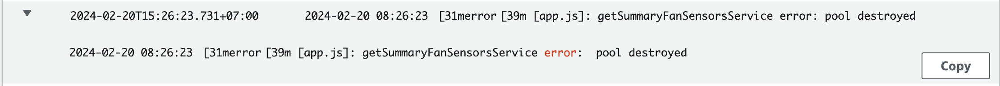

---
authors:
  - PaPu
categories:
  - devops
date: 2024-02-20
draft: false
---

# MongoDB upgrade version

## [Upgrade Procedures](https://www.mongodb.com/docs/v5.0/release-notes/5.0/#upgrade-procedures)

Upgrade có nhiều trường hợp tuỳ theo cách deploy của dự án như:

- [Upgrade a standalone to 5.0](https://www.mongodb.com/docs/v5.0/release-notes/5.0-upgrade-standalone/)
- [Upgrade a Replica Set to 5.0](https://www.mongodb.com/docs/v5.0/release-notes/5.0-upgrade-replica-set/)
- [Upgrade a Shared Cluster to 5.0](https://www.mongodb.com/docs/v5.0/release-notes/5.0-upgrade-sharded-cluster/)

<!-- more -->

Bài này mình note với upgrade replica set, với hai trường hợp còn lại tham khảo trong link trên.

Trước khi upgarde cần check các:

- [checklist](https://www.mongodb.com/docs/v5.0/release-notes/5.0-upgrade-replica-set/#upgrade-recommendations-and-checklists): ví dụ muốn lên `5.0` thì version hiện tại tối thiểu phải là `4.4`
- [Prerequisites](https://www.mongodb.com/docs/v5.0/release-notes/5.0-upgrade-replica-set/#prerequisites)

### [Các bước upgrade mongodb version](https://www.mongodb.com/docs/v5.0/tutorial/upgrade-revision/#upgrade-replica-sets)

1. Upgrade secondary members of the replica set.

- Tắt mongo process
- Upgrade version
- Chờ secondary join replicas ổn định hãng làm tiếp: `rs.status()`

2. Stepdown replica set primary

3. Upgrade the primary

- Upgrade primary như upgrade secondary

4. Enable backwards-incompatible 5.0 features.

- Khi upgrade có thể có 1 số tính năng cần cấu hình cụ thể để version cũ và mới tương thích với nhau. Cái này cần check cụ thể với từng version mình định uprade lên.

## Một số lưu ý trong quá trình upgrade

- Cần check trước mongo đang lưu cấu hình ở đâu, `data` đang được lưu ở đâu. Tránh trường hợp cấu hình mặc định đã bị thay đổi và khi cài mongo version các file cấu hình ko ăn hoặc file data ko được map đúng - thôi xong.
- `Upgrade version` cho 1 replica cụ thể (secondary, primary , arbiter (nếu mô hình RSA)) chính là bước [install mongo](https://www.mongodb.com/docs/v5.0/tutorial/install-mongodb-on-ubuntu/#install-mongodb-community-edition-on-ubuntu). Lưu ý đoạn: `mongodb` packaged cung cấp bởi ubuntu ko phải là official từ MongoDB Inc, phải là `mongodb-org`
- Quá trình upgrade đừng quên setup như dưới để ngăn việc upgrade ngoài ý muốn:

```linenums="1"
echo "mongodb-org hold" | sudo dpkg --set-selections
echo "mongodb-org-database hold" | sudo dpkg --set-selections
echo "mongodb-org-server hold" | sudo dpkg --set-selections
echo "mongodb-org-shell hold" | sudo dpkg --set-selections
echo "mongodb-org-mongos hold" | sudo dpkg --set-selections
echo "mongodb-org-tools hold" | sudo dpkg --set-selections
```

- Sau khi upgrade cho `secondary`, trước khi start với `primary` nên chờ cho `secondary` [đồng bộ](https://stackoverflow.com/questions/19675117/how-to-check-secondary-is-synced-now-or-not) với `primary` hãng bắt đầu tiếp.
- Trên `primary` nếu: `rs.stepDown()` ko được có thể xem xét dùng lệnh [db.adminCommand](https://www.mongodb.com/docs/manual/reference/command/replSetStepDown/#syntax) để stepDown. [Ví dụ](https://stackoverflow.com/a/51183797/1406656):

```linenums="1"
db.adminCommand( { replSetStepDown: 120, secondaryCatchUpPeriodSecs: 15, force: true } )
```

- Theo như doc của mongo có thể có downtime từ 10 -> 20s: `During failover, the set cannot accept writes. Typically this takes 10-20 seconds. Plan the upgrade during a predefined maintenance window.` -> nên thực hiện upgrade trong thời gian bảo trì đã được thông báo.

- Nên thực hiên trước trên môi trường QA để test trước khi lên Prod. Như với trường hợp của mình sau khi secondary lên làm master - primary xuống làm slave -> thấy dịch vụ bị down log báo pool destroyed:



- Vậy thôi!

**_HAPPY WORKING!!!_**
