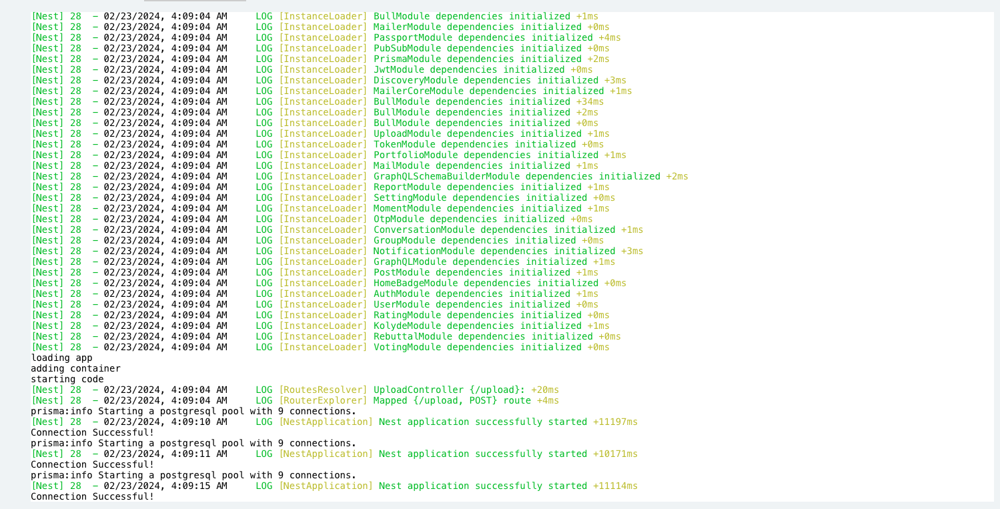
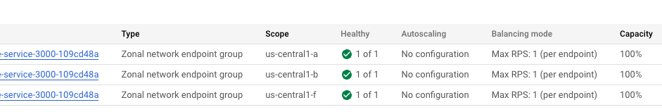

---
authors:
  - PaPu
categories:
  - devops
date: 2024-02-26
draft: false
---

# TIL GKE Error: Server Error

## Hiện tượng

- Sau khi config `deployment.yaml` , `service.yaml`, `ingress.yaml` chuẩn rồi ( cứ cho là thế đi :D):

  - view trên argoCD: `ingress`, `service`, `deployment` đều `healthy` (deployment ko cấu hình readiness hay liveness).
  - App trong pod log đã start, bình thường.
  - Nếu dùng `kubeclt` để port forward service về local và truy cập từ localhost vẫn truy cập bình thường.

- Nhưng khi truy cập từ domain mình vẫn gặp lỗi `Error: Server error` như hình:

<!-- more -->

- Check log app trong pod thì ko hề có log ( truy cập chưa đến được application - có vẻ bị dừng từ ngoài):
  

- Như ảnh trên thì chỉ có log started app ko có log của truy cập từ ngoài vào.

## Nguyên nhân

- Sau khi google thì mình thấy có 1 idea về việc ingress healcheck app bị failed nên ko redirect traffic vào dẫn đến tình trạng báo server error như vậy.
- Kiểm tra như thế nào?

  - `kubectl get ingress`: để lấy ra ingress name cần check
  - `kubectl describe ingress <ingress_name_from_above>`: check output sẽ thấy annotations đang là: `UNHEALTHY`,

- Và nếu check trên GCP console: `Network-service` -> `loadbalancing` sẽ thấy service được tạo từ `service.yaml` ở đây mình tạo 3 pod và cả 3 đều báo unhealthy.

## Fix

- Sau khi báo dev add thêm health check cho endpoint `/` thì service dần trở lại healthy( mình bỏ qua service name vì lý do bảo mật) - trước đó cả ba đều `unhealthy`:

- Và service đã truy cập được bình thường.

- Summary:
  - Nhìn trên argo thì từ deployment, service và ingress đều healthy ( dù deployment ko config liveness và readiness)
  - Nhưng check service trên GCP console hoặc từ CLI sẽ thấy thật ra service có thể unhealthy nếu `/` ko trả về status code 200. -> cần support thêm endpoint `/` để health-check ok.
- Vậy thôi: **_HAPPY WORKING DEVOPS_**
