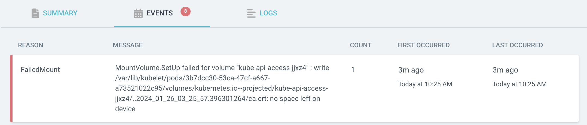

---
authors:
  - PaPu
categories:
  - devops
date: 2024-05-02
draft: false
---

# TIL k8s resource limit

## Hiện tượng

- Mình thấy báo lỗi liên quan ko đủ volume như ảnh dưới:
  
- Dù hiện tại không mount cái gì vào pod cả
- Fix thử liên quan no space left on device fix lòi kèn ko ra :|

<!-- more -->

## Nguyên nhân

- Nguyên nhân thực sự hơi ối giồi ôi ko liên quan đến thông báo lỗi ( ko liên quan gì đến space left on device cả).
- Phần cấu hình deployment sau khi hỏi chatGPT mình copy nguyên vào đại khái giống như thế này:

```yaml
resources:
  limits:
    cpu: 2
    memory: "2"
  requests:
    cpu: 2
    memory: "2"
```

## Fix

- Đại khái thế ko nhớ chính xác. Làm thế nào mò ra thì mình cũng quên rồi (google thôi). Nhưng sau khi sửa lại thành chính xác như bên dưới thì ko bị lỗi nữa:

```yaml
resources:
  limits:
    cpu: "2"
    memory: "2Gi"
  requests:
    cpu: "2"
    memory: "2Gi"
```

- Vậy đó: Cấu hình CPU, RAM sai nhưng báo lỗi no space left on device :v
  **_ HAPPY WORKING_**
