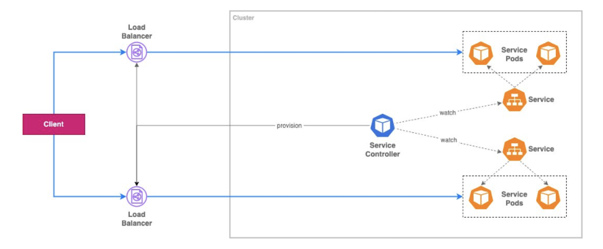
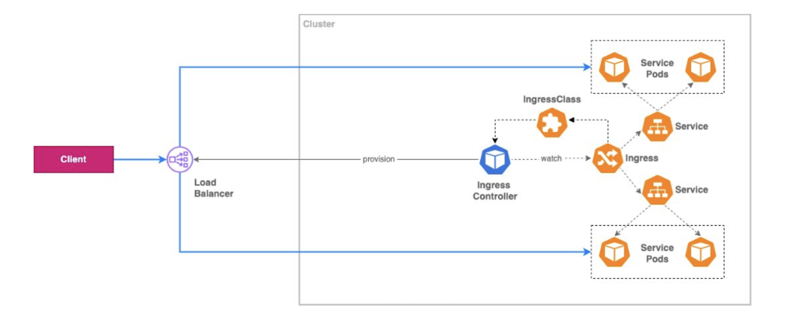
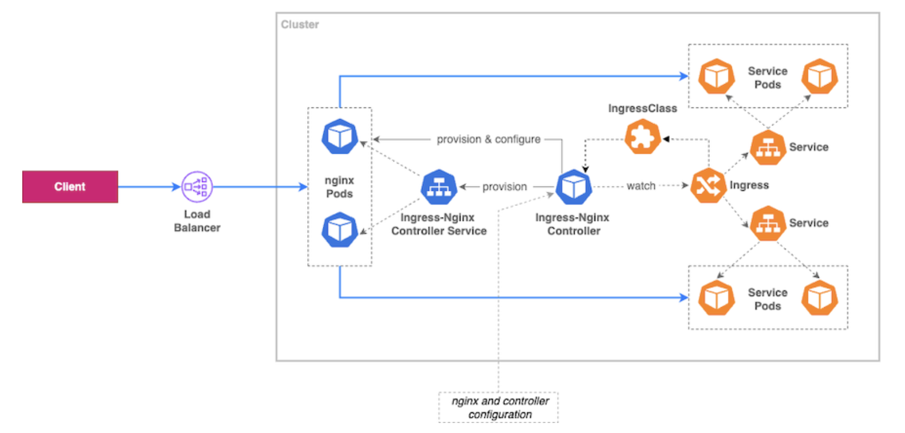

---
authors:
  - PaPu
categories:
  - devops
  - terraform
date: 2025-10-03
draft: true
---

# EKS Overview

## Mục Lục

- Bài này sẽ đề cập các vấn đề:
  - Quản lý truy cập:
    - Cấp quyền cho người dùng truy cập eks cluster: Từ bên ngoài vào trong eks cluster.
    - Cấp quyền cho các ứng dụng trong eks cluster truy cập được các dịch vụ AWS: Từ bên trong eks cluster ra bên ngoài.
  - Expose ứng dụng trong eks ra ngoài Internet.

<!-- more -->

## Cấp quyền truy cập eks cluster

- Có 2 phương thức để người dùng truy cập eks cluster:

  - AWS IAM: khi tạo mới cluster chúng ta chọn 1 trong 2 hoặc cả 2 cách dưới
    - `aws-auth ConfigMap`
    - `access entries`
  - Dùng OIDC provider bên ngoài (mình sẽ bỏ qua phần này).

### aws-auth ConfigMap

- Best practice thì nên allow role thay vì user truy cập vào eks cluster.
  - Tạo IAM role
  - Tạo IAM user với quyền assume IAM Role
  - Tạo k8s `Role` và k8s `RoleBinding` bind vào group: `eks-viewers` trong k8s

```yaml
# rolebinding-view.yaml
apiVersion: rbac.authorization.k8s.io/v1
kind: ClusterRoleBinding
metadata:
  name: readonly-binding
roleRef:
  apiGroup: rbac.authorization.k8s.io
  kind: ClusterRole
  name: view # role mặc định của Kubernetes
subjects:
  - kind: Group
    name: eks-viewers
    apiGroup: rbac.authorization.k8s.io
```

- Cập nhật `aws-auth ConfigMap` cho phần mapRoles như dưới:

```yaml
mapRoles: |
- rolearn: arn:aws:iam::123456789012:role/EKSReadOnlyRole
  username: eks-readonly
  groups:
    - eks-viewers

```

- Sau khi apply cấu hình: IAM user assume -> IAM Role -> map với k8s group: `eks-viewers`-> group này binding với k8s role `view` : nên người dùng sẽ có quyền xem các resource trong k8s.

- Lưu ý:
  - `aws-auth ConfigMap`đã lỗi thời, cluster tạo mới mặc định ko còn dùng cách này để xác thực.
  - việc chỉnh sửa `aws-auth` trong ConfigMap tiềm ẩn rủi ro, mình đã gặp nhiều trường hợp thực tế sửa sai file này dẫn đến ko truy cập eks cluster, nên dùng tool hỗ trợ như `eksctl` -> có lẽ đây là 1 trong các lý do nó nên deprecated.

### access entries

- Với `aws-auth ConfigMap` khi thêm user hoặc role mới -> cần chỉnh sửa cả aws và k8s cluster(ConfigMap `aws-auth`). Với access entry khi thêm user hoặc role việc chỉnh sửa chỉ cần ở phía aws -> tiện hơn rất nhiều, tránh sửa sai trong k8s ngoài ra việc này có thể thực hiện bằng các tool IaC: terraform

- Các bước khi cấp quyền truy cập cho một IAM user qua IAM Role:

  - Tạo IAM Role.
  - Tạo IAM user với quyền assume IAM Role ở trên.
  - Trong tab `access entry` trong eks cluster:

    - Tạo một `access entry` cho IAM role.
    - Associate `acess entry` với [access policies](https://docs.aws.amazon.com/eks/latest/userguide/access-policy-permissions.html) tương ứng. Các access polices này được định nghĩa sẵn các quyền trong k8s và được quản lý bởi AWS, người dùng ko thể thay đổi.

    - Trong trường hợp ko muốn dùng `access polices` có sẵn. Chúng ta có thể:
      - Tạo k8s `Role` và k8s `RoleBinding` bind vào k8s group (step này giống với `aws-auth ConfigMap`)
      - Sau đó chỉ định group này cho `access entry`.

- Nhận xét:

  - Nếu dùng access policies -> việc cấp quyền chỉ liên quan phía aws chúng ta ko cần thay đổi gì trong k8s.
  - Nếu dùng `Role` và `RoleBinding` thì việc cấu hình sai cũng ko ảnh hưởng gì đến user cũ truy cập vào eks cluster (so với nếu chúng ta sửa apply nhầm `aws-auth` ConfigMap).

- `access entry`: có các type khác nhau, cũng như các access policies định nghĩa sẵn xem thêm [aws doc](https://docs.aws.amazon.com/eks/latest/userguide/access-entries.html) nhé :D

## Cấp quyền eks cluster truy cập AWS services (Workload accses to AWS)

- AWS EKS cung cấp 2 cách để workload trong eks truy cập tài nguyên AWS:
  - IAM roles for service accounts(`IRSA`): IAM Role cho k8s service account :D
  - EKS Pod identities.
- Bạn có thể xem qua so sánh giữa 2 phương thức này ở: [Comparing EKS Pod Identity and IRSA](https://docs.aws.amazon.com/eks/latest/userguide/service-accounts.html#service-accounts-iam)

### [IRSA](https://docs.aws.amazon.com/eks/latest/userguide/iam-roles-for-service-accounts.html)

- **How it work**: Annotate k8s ServiceAccount với IAM Role. Pod với ServiceAccount assume IAM Role thông qua OIDC provider của cluster.
- Các bước cấu hình:

  - Tạo IAM OIDC provider cho eks cluster:
    - Trong AWS eks cluster tab `Overview` lưu lại: `OpenID Connect provider URL`.
    - Trong AWS IAM chọn `Identity Provider`. Tạo mới 1 provider với:
      - `type` là `OpenID Connect`.
      - `URL` là URL của eks cluster bên trên.
      - `Audience` là `sts.amazonaws.com`.
  - Gán IAM Roles vào k8s service account:

    - Tạo IAM Role với `assume-role-policy` là OIDC provider URL của eks cluster. Example dưới cấu hình cả namespace và service account:

      ```json
      {
        "Version": "2012-10-17",
        "Statement": [
          {
            "Effect": "Allow",
            "Principal": {
              "Federated": "arn:aws:iam::$account_id:oidc-provider/$oidc_provider"
            },
            "Action": "sts:AssumeRoleWithWebIdentity",
            "Condition": {
              "StringEquals": {
                "$oidc_provider:aud": "sts.amazonaws.com",
                "$oidc_provider:sub": "system:serviceaccount:$namespace:$service_account"
              }
            }
          }
        ]
      }
      ```

    - Annotate k8s service account với IAM Role bên trên:

      ```sh
      kubectl annotate serviceaccount -n $namespace $service_account eks.amazonaws.com/role-arn=arn:aws:iam::$account_id:role/my-role
      ```

  - Tạo Policy với quyền chúng ta muốn cấp cho Pod.
  - Attach Policy vào Role.

  - Cấu hình Pod dùng k8s service account. Deployment sử dụng service account ở trên thôi:

  ```yaml
  apiVersion: apps/v1
  kind: Deployment
  metadata:
  name: my-app
  spec:
  selector:
    matchLabels:
      app: my-app
  template:
    metadata:
      labels:
        app: my-app
    spec:
      serviceAccountName: $service_account
      containers:
        - name: my-app
          image: public.ecr.aws/nginx/nginx:X.XX
  ```

### EKS Pod Identities
- **How it work**: EKS API quản lý association giữa IAM Roles và ServiceAccounts. Pod assume IAM Role via Pod Identity Agent.
- Pod Identity thì đơn giản hơn IRSA: không sử dụng OIDC Identity Providers, service account cũng ko cần cấu hình phần `annotate`
- Các bước cấu hình:

  - Setup Pod Identity Agent. Có thể cài đặt add-on Pod Identity cho eks cluster theo nhiều cách:

    - AWS CLI.
    - AWS console.
    - Hay terraform:

    ```terraform
    resource "aws_eks_addon" "pod_identity" {
      cluster_name  = aws_eks_cluster.eks.name
      addon_name    = "eks-pod-identity-agent"
      addon_version = var.pod_identity_version
    }
    ```

  - Create IAM Policy với permission cho Pod mà chúng ta muốn cấp quyền.
  - Tạo IAM Role cho phép Pod trong eks được Assume Role. Phần trust policy trông sẽ như dưới.
    ```json
    {
      "Version": "2012-10-17",
      "Statement": [
        {
          "Sid": "AllowEksAuthToAssumeRoleForPodIdentity",
          "Effect": "Allow",
          "Principal": {
            "Service": "pods.eks.amazonaws.com"
          },
          "Action": ["sts:AssumeRole", "sts:TagSession"]
        }
      ]
    }
    ```
  - Attach IAM Policy ở trên với IAM Role
  - Associate IAM Role cho k8s service account (service account này có thể tồn tại rồi hoặc chưa). Step này cũng có thể tạo bằng nhiều cách:

    - AWS Console
    - AWS CLI

    ```sh
    aws eks create-pod-identity-association --cluster-name my-cluster --role-arn arn:aws:iam::111122223333:role/my-role --namespace default --service-account my-service-account
    ```

    - Terraform: Ví dụ dưới tạo 1 association IAM Role với service_account `aws-load-balancer-controller` cho eks cluster.

    ```terraform
    resource "aws_eks_pod_identity_association" "aws_lbc" {
      cluster_name    = aws_eks_cluster.eks.name
      namespace       = "kube-system"
      service_account = "aws-load-balancer-controller"
      role_arn        = aws_iam_role.aws_lbc.arn
      depends_on      = [aws_eks_addon.pod_identity]
    }
    ```

  - Deploy Pod với service account trên.
  - Ngoài ra thì IAM Role cũng có thể cấu hình Pod thuộc namespace và service account [cụ thể](https://docs.aws.amazon.com/eks/latest/userguide/pod-id-role.html).

## Expose applications ra Internet

- AWS blog có bài khá chi tiết mọi người có thể tham khảo ở đây: [Part 1](https://aws.amazon.com/vi/blogs/containers/exposing-kubernetes-applications-part-1-service-and-ingress-resources/), [Part 2](https://aws.amazon.com/vi/blogs/containers/exposing-kubernetes-applications-part-2-aws-load-balancer-controller/), [Part 3](https://aws.amazon.com/vi/blogs/containers/exposing-kubernetes-applications-part-3-nginx-ingress-controller/)

- Bài toán cho phần này eks cluster đặt trong private subnet của AWS VPC làm sao có thể expose applications ra ngoài Internet để người dùng truy cập. Dưới đây là một số cách:
  - Service: type LoadBalancer
  - Ingress: Ingress chỉ định nghĩa các Rule và dựa vào `Ingress Controller` để expose app, khởi tạo loadbalancer. Không có `ingress controller` mặc định nào được cài trong `controller manager` của k8s. Chúng ta cần cài đặt các `ingress controller` này:
    - AWS LoadBalancer Controller: Dùng ingress controller của AWS. Cần phân biệt đây là: AWS LBC ( loadbalancer controller), 1 controller được cài trong k8s khác với AWS ELB (AWS elastic loadbalancer trong EC2)
    - Ingress controller bên ngoài: ingress-nginx-controller, kong...

### Service



- Khi `service` trong eks được cấu hình type `LoadBalancer`: AWS loadbalancer đã được provision như thế nào ?
  - [cloud-controller-manager](https://kubernetes.io/docs/concepts/architecture/#cloud-controller-manager) trong `control-plane` sẽ đảm nhận vai trò provision Loadbalancer cho service.
- Ưu điểm: Nhanh. Chỉ cần cấu hình service type loadbalancer là đã expose app ra internet ko cần setup gì thêm.
- Nhược điểm:
  - cloud-controller-manager nằm trong control-plane là 1 phần của k8s (nên cách này còn gọi: `in-tree`) bởi vậy update hay fix bug của cloud sẽ bị chậm phải đợi release theo k8s.
  - Chỉ provision được AWS classic hoặc network loadbalancer (ko có ALB).
  - Vì là service nên ko hỗ trợ được routing HTTP, HTTPS như ingress.
  - Tốn: mỗi một service với type LoadBalancer sẽ tạo ra thêm 1 AWS LB.

### AWS LB controller



- Khi cài đặt AWS-LBC: `ingress-controller` của nó sẽ đảm nhiệm việc provision các loadbalancer bằng cách kiểm tra các annotation của các ingress để khởi tạo loadbalancer.

- Ưu điểm:
  - Vì là controller riêng biệt support bởi AWS không nằm trong k8s release( hay còn gọi `out-tree`) nên các update và fix bug sẽ nhanh hơn ko cần phụ thuộc vào release của k8s
  - Hỗ trợ NLB, ALB.
- Nhược điểm:
  - Cấu hình phức tạp hơn 1 chút so với `service.type: LoadBalancer`

### ingress-nginx-controller



- Khi cài đặt `ingress-nginx-controller` các phần sau cũng được tạo:
  - ingress controller của ingress-nginx-controller.
  - service của ingress-nginx-controller type LoadBalancer: LB được tạo bởi `cloud-controller-manager` như phần service ở trên.
  - nginx Pod của ingress-nginx-controller: thằng này hoạt động như layer7 reverse proxy.
- Ưu điểm:
  - Mặc dù sử dụng `in-tree` service để tạo LB nhưng phần định tuyến do nginx đảm nhiệm nên ko bị các giới hạn như của service ở trên.
  - Quản lý được nhiều hơn do phần layer 7 reverse proxy: đương nhiên phần update và fix bug cũng được cập nhật nhanh ko như `in-tree`.
  - Cũng có thể rẻ hơn so với ALB của AWS LBC.
- Nhược điểm:
  - Cấu hình phức tạp hơn.
- Ngoài ra bên cạnh việc dùng service `in-tree` để tạo NLB thì chúng ta cũng có thể cài AWB LBC để tạo NLB cho ingress-nginx-controller.

### HAPPY WORKING!!!
