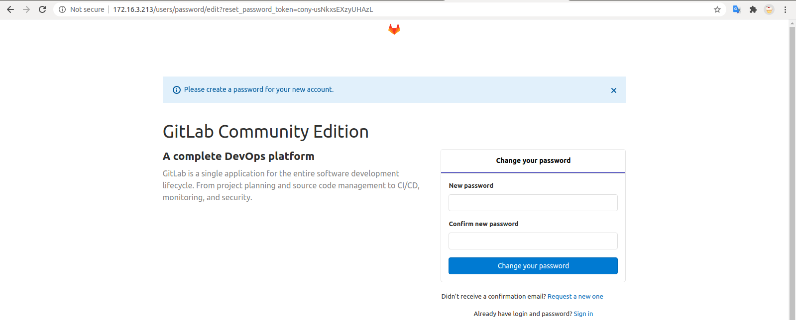

# Cài đặt gitlab trên local

- Có thể cài đặt gitlab thẳng trên host. Nhưng cài qua docker tiện dụng hơn khi nâng cấp hay xóa ứng dụng.
- Chuẩn bị trước khi cài đặt:
  - Ubuntu (Mac, win cũng được, tài liệu này chạy trên ubuntu 20.04 LTS).
  - Docker version
  - Có kiến thức cơ bản về docker.
  - Port dùng cho gitlab (443, 80, 22) nếu có không bị chiếm bởi ứng dụng khác.

## Before start

- Problem:
- Solution:
- Discussion:

## Install

### Xác định private IP trên máy

- Chạy lệnh `ifconfig`:

```sh
$ ifconfig
enp37s0: flags=4163<UP,BROADCAST,RUNNING,MULTICAST>  mtu 1500
        inet 172.16.3.213  netmask 255.255.0.0  broadcast 172.16.255.255
        inet6 fe80::55dd:32bd:b1b9:6b9f  prefixlen 64  scopeid 0x20<link>
        ether 2c:f0:5d:33:b7:af  txqueuelen 1000  (Ethernet)
        RX packets 686611  bytes 206365419 (206.3 MB)
        RX errors 0  dropped 67469  overruns 0  frame 0
        TX packets 38625  bytes 4403778 (4.4 MB)
        TX errors 0  dropped 0 overruns 0  carrier 0  collisions 0
```

- Như output trên thì private IP của máy: `172.16.3.213`. Nếu máy có public IP hoặc domain thì có thể sử dụng (gitlab sau khi cài đặt có thể truy cập từ internet).

### Cài đặt

- Hướng dẫn trang chủ cho [docker](https://docs.gitlab.com/omnibus/docker/):

```sh
  sudo docker run --detach \
  --hostname gitlab.example.com \
  --publish 443:443 --publish 80:80 --publish 22:22 \
  --name gitlab \
  --restart always \
  --volume $GITLAB_HOME/config:/etc/gitlab:Z \
  --volume $GITLAB_HOME/logs:/var/log/gitlab:Z \
  --volume $GITLAB_HOME/data:/var/opt/gitlab:Z \
  gitlab/gitlab-ce:latest
```

- Nhận xét:

  - Không cài chạy docker image với version `latest`. Latest không phải là version.

  - Đổi domain `gitlab.example.com` thành private IP (có thể thay bằng domain nếu có - hoặc public IP).

  - Bỏ port 443 ( chưa có SSL), bỏ port 22 nếu host đang chạy dịch vụ ssh nếu ko bỏ port 22 container khi chạy sẽ ở trạng thái `Created` không chuyển sang `up` được.

- Với private IP: `172.16.3.213` và một số thay đổi theo nhận xét trên, chạy lệnh như dưới để cài đặt gitlab. Có thể thay đổi `13.0.5-ce.0` bằng version mới nhất.

```sh
    sudo docker run --detach \
    --hostname 172.16.3.213 \
    --publish 80:80 \
    --name gitlabCE \
    --restart always \
    --volume /srv/gitlab/config:/etc/gitlab \
    --volume /srv/gitlab/logs:/var/log/gitlab \
    --volume /srv/gitlab/data:/var/opt/gitlab \
    gitlab/gitlab-ce:13.0.5-ce.0
```

- Nếu chưa có image thì cần chờ 1 lúc để tải image về và thêm thời gian cho container up.
- Sau đó truy cập private IP như dưới là đã có gitlab để xài :3. Nhập mật khẩu và dùng mật khẩu này với tài khoản `root`.


