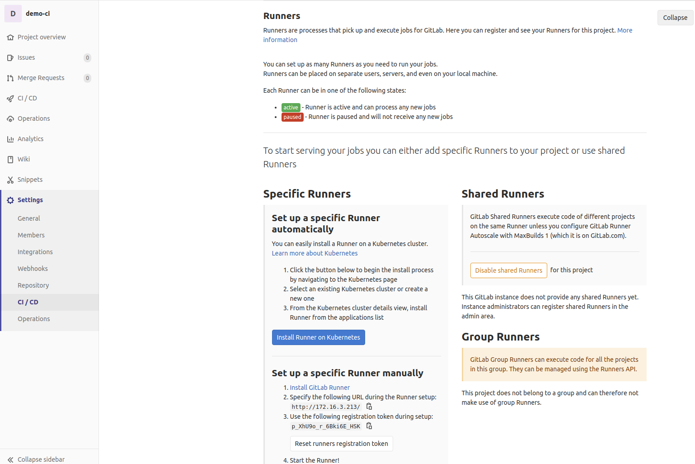
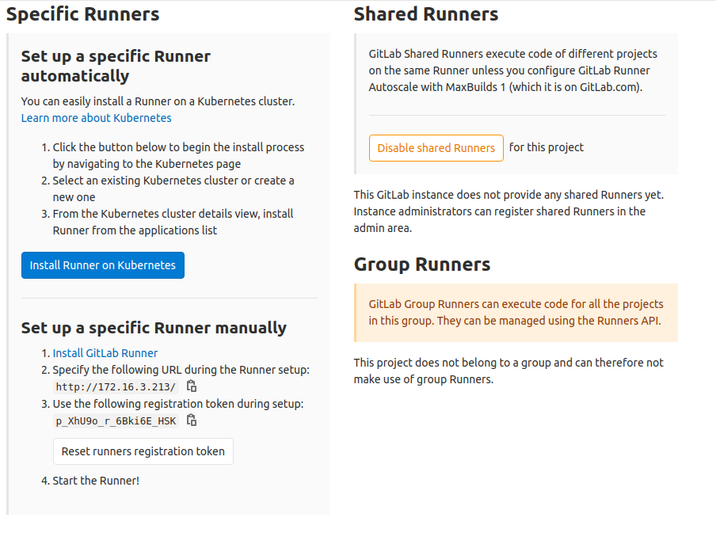
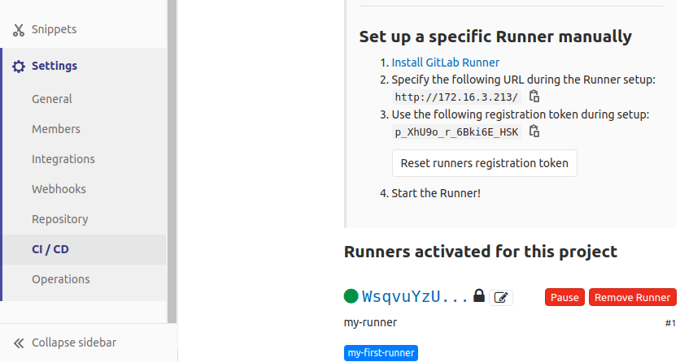

# Install GitLab Runner (aka Runner)

- Tài liệu này cài đặt Runner trên:

  - Ubuntu 20.04 LTS ( các version khác hay các hệ điều hành khác thì cũng na ná).
  - Docker
  - Cần có một chút kiến thức cơ bản docker

- Ngắn gọn: Runner là gì ? tại sao lại là Runner:

  - Runner là một dự án mã nguồn mở được sử dụng để chạy `jobs`( của gitlab) và gửi lại kết quả cho GitLab. Được sử dụng kết hợp với [GitLab CI/CD](https://about.gitlab.com/stages-devops-lifecycle/continuous-integration/). Muốn chi tiết hơn thì cần tìm hiểu thêm về CI/CD.

  - Bên cạnh Runner trước đó có Jenkins có vẻ là một best practice hơn cho CI/CD trong một số trường hợp cụ thể. Tuy nhiên một số tác vụ nhỏ thì cứ thử luôn Runner cho tiện.

- Tài liệu trang chủ cho cài đặt Runner trên docker [ở đây](https://docs.gitlab.com/runner/install/docker.html).

## Before start

- Problem:
- Solution:
- Discussion:

## Run GitLab Runner

- Có 2 tùy chọn để chạy Runner ở đây mình chạy luôn option 1. Cấu hình hướng dẫn ntn:

```sh
  docker run -d --name gitlab-runner --restart always \
  -v /srv/gitlab-runner/config:/etc/gitlab-runner \
  -v /var/run/docker.sock:/var/run/docker.sock \
  gitlab/gitlab-runner:latest
```

- Comment: không dùng version `latest`.
- Chạy lệnh dưới để có Gitlab Runner trên docker, có thể thay `v13.1.1` với version mới nhất:

  ```sh
  sudo docker run -d --name gitlab-runner --restart always \
  -v /srv/gitlab-runner/config:/etc/gitlab-runner \
  -v /var/run/docker.sock:/var/run/docker.sock \
  gitlab/gitlab-runner:v13.1.1
  ```

## [Setup](https://docs.gitlab.com/runner/register/index.html#docker)

- Các bước trên đã tạo ra một Runner chạy trên docker. Bước tiếp theo cần `bind` Runner vào Gitlab (đã có từ trước [ở đây](http))

- Khi Gitlab chưa được bind Runner nào vào một project: **Settings ~> CI/CD ~> Runner** click `Expand` sẽ ntn:
  

- Các bước tiếp theo dưới đây theo hướng dẫn gitlab:

  1. Chạy câu lệnh đăng ký:

  ```sh
  docker run --rm -it -v /srv/gitlab-runner/config:/etc/gitlab-runner gitlab/gitlab-runner:v13.1.1 register
  ```

  2. Nhập địa chỉ URL của gitlab

  - Link URL gitlab và token có thể lấy trong cấu hình của một project: **Settings ~> CI/CD ~> Runner**

    - 

  - Như trong ảnh URL: `http://172.16.3.213/`

  3. Nhập token

  - Như trong ảnh trên token: `p_XhU9o_r_6Bki6E_HSK`

  4. Nhập mô tả cho runner

  - Ví dụ: `my-runner`

  5. Nhập tag cho runner vừa cài đặt.

  - Ví dụ: `my-first-runner`.

  6. Điền [Runner Executor](https://docs.gitlab.com/runner/executors/README.html)

  - Ví dụ: `docker`

  7. Điền image name

  - Nếu executor là `docker` thì mới cần điền thêm `image` khi người dùng không định nghĩa image trong `.gitlab-ci.yml`
  - Ví dụ nhập: `ubuntu` - Trong trường hợp này thì nên dùng tag latest.

- Hoàn tất các bước trên terminal trông ntn:

```sh
$ sudo docker run --rm -it -v /srv/gitlab-runner/config:/etc/gitlab-runner gitlab/gitlab-runner:v13.1.1 register
Runtime platform                                    arch=amd64 os=linux pid=6 revision=6fbc7474 version=13.1.1
Running in system-mode.

Please enter the gitlab-ci coordinator URL (e.g. https://gitlab.com/):
http://172.16.3.213/
Please enter the gitlab-ci token for this runner:
rWZxJE5jgCRyxTHUf2dp
Please enter the gitlab-ci description for this runner:
[0647bb754faa]: one of my runners
Please enter the gitlab-ci tags for this runner (comma separated):
first-runner
Registering runner... succeeded                     runner=rWZxJE5j
Please enter the executor: ssh, docker+machine, docker, docker-ssh, shell, virtualbox, docker-ssh+machine, kubernetes, custom, parallels:
docker
Please enter the default Docker image (e.g. ruby:2.6):
ubuntu
Runner registered successfully. Feel free to start it, but if it's running already the config should be automatically reloaded!
```

- Nếu quay lại **Settings ~> CI/CD ~> Runners** Click `expand` sẽ thấy Runner được gán vào ntn:

  

- Click biểu tượng `edit` của Runner và tích chọn vào `Run untagged jobs` để chạy cả các jobs untagged. Click `save changes`.
